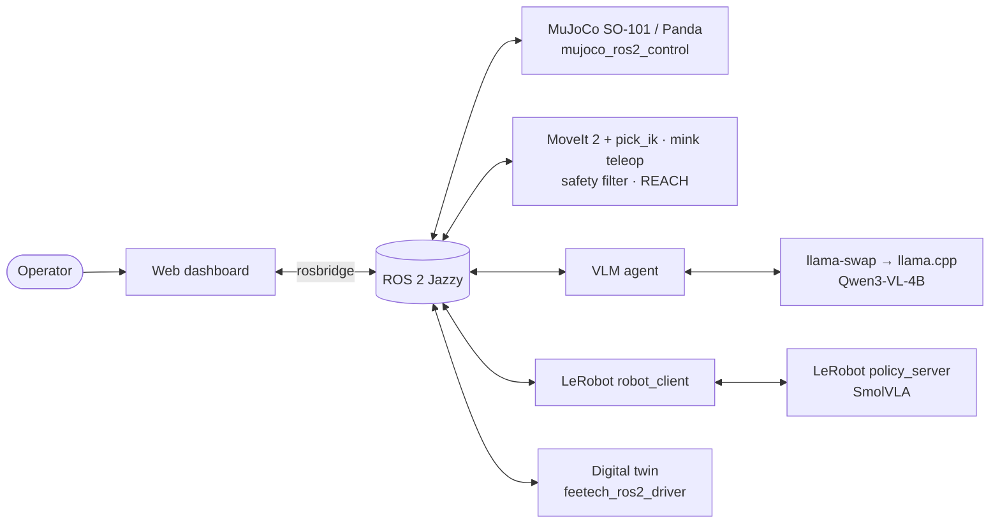

# CogniBot-ROS2-VLA

> **Language → vision → action on a laptop GPU.** A fully containerized ROS 2 Jazzy manipulation stack. A local vision-language model (Qwen3-VL-4B on llama.cpp) grounds requests in the camera image and calls robot tools. Those tools are MoveIt 2 motion planning and LeRobot SmolVLA inference, running on a MuJoCo-simulated LeRobot SO-101 arm (or a Franka Panda), with sphere-based collision safety and a web operator console.

  

**Target hardware:** RTX 3060 Laptop (6 GB VRAM) · 40 GB RAM · Ubuntu 24.04 · Docker + NVIDIA Container Toolkit

---

## Why this project

Small VLAs and VLMs now fit on consumer GPUs, but wiring them into a real robot software stack is still the hard part: Python and ROS version conflicts, GPU memory contention, several controllers competing for one arm, and learned policies with no notion of collisions. CogniBot is an **integration project**. It connects mature open-source components into one reproducible system and adds the missing glue: control-mode arbitration, a streaming safety filter, VLM tools and an operator UI.

## Architecture at a glance



| Profile | Services | Use |
|---|---|---|
| *(core)* | sim · motion · bridge · dashboard | Simulation, teleop (WASD / ↑↓ / G), planning |
| `vlm` | + llm · vlm-agent | Natural-language pick-and-place via tool calls |
| `vla` | + policy-server · vla-client | SmolVLA skills streamed at 30 Hz |
| `twin` | + twin | Mirror a real (or mock) SO-101 into MuJoCo |
| `full` | vlm + vla | Everything |

## Built on

MuJoCo Menagerie SO-101 · so101-nexus scenes · mujoco_ros2_control · MoveIt 2 · pick_ik · mink · foam · ROS-Industrial REACH · so101-ros-physical-ai · LeRobot (async inference, SmolVLA) · lerobot-ros · llama.cpp · llama-swap · Qwen3-VL · rosbridge_suite. Pins and rationale are in [docs/INTEGRATIONS.md](docs/INTEGRATIONS.md).

## Quick start

```bash
git config core.hooksPath .githooks
make env          # creates cognibot_ws/docker/.env with your UID/GID
make config       # validates every compose profile
make build        # core, vlm and vla images
make sim          # headless MuJoCo sim (ROBOT=so101|panda, ROBOT_COLOR=red|stock)
make deps sim-dev # same, with the MuJoCo viewer window (X11)
make demo         # viewer + scripted pick-and-place
make moveit       # viewer + MoveIt RViz: drag the goal marker, Plan & Execute
make test         # all workspace tests in the core image (needs the NVIDIA GPU)
```

The operator dashboard (http://localhost:8000) arrives in Phase 3.

Host preparation (NVIDIA toolkit, EGL, DDS buffers): [docs/SETUP.md](docs/SETUP.md).

## Roadmap

| Phase | Milestone | Status |
|---|---|---|
| P0 | Foundation: docs, workspace, interfaces, Docker/Compose, CI | 🟢 done (v0.1.0) |
| P1 | Headless MuJoCo sim with controllers, RGB-D cameras, Panda variant | 🟢 done (v0.2.0) |
| P2 | MoveIt 2 + pick_ik, mink teleop, collision spheres, safety filter, reachability | 🟡 next |
| P3 | Web operator console | ⏳ |
| P4 | Qwen3-VL tool-calling agent with 3D grounding | ⏳ |
| P5 | SmolVLA via LeRobot async inference, measured VRAM budget | ⏳ |
| P6 | Digital twin connector | ⏳ |
| P7 | Benchmarks, demos, v1.0 | ⏳ |

Details: [docs/PROJECT_PLAN.md](docs/PROJECT_PLAN.md) · Scope and success criteria: [docs/PROJECT_SCOPE.md](docs/PROJECT_SCOPE.md)

## Documentation

| Doc | Contents |
|---|---|
| [ARCHITECTURE](docs/ARCHITECTURE.md) | Services, packages, robot registry, control modes, data flows, safety geometry |
| [NETWORKING](docs/NETWORKING.md) | DDS configuration, ports, QoS, bandwidth, troubleshooting |
| [ROS_INTERFACES](docs/ROS_INTERFACES.md) | Topics, services, actions and custom interface definitions |
| [VRAM_BUDGET](docs/VRAM_BUDGET.md) | GPU/RAM budget and llama.cpp offload profiles |
| [INTEGRATIONS](docs/INTEGRATIONS.md) | Every upstream component, pin and alternative considered |
| [DEVLOG](docs/DEVLOG.md) | Engineering log: problems, root causes, solutions, decision trees |
| [ADRs](docs/adr/README.md) | Architecture decision records |
| [CHANGELOG](CHANGELOG.md) | User-visible changes |

## License

Apache-2.0 © Vignesh. Third-party components keep their own licenses; see [THIRD_PARTY_NOTICES.md](THIRD_PARTY_NOTICES.md).
