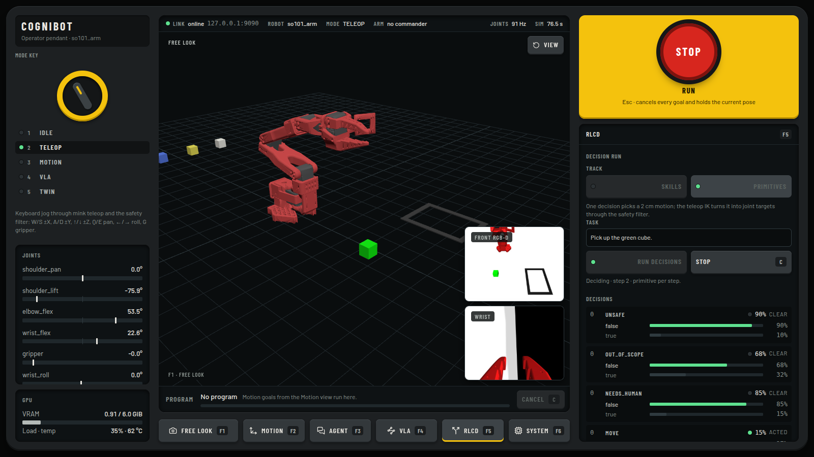
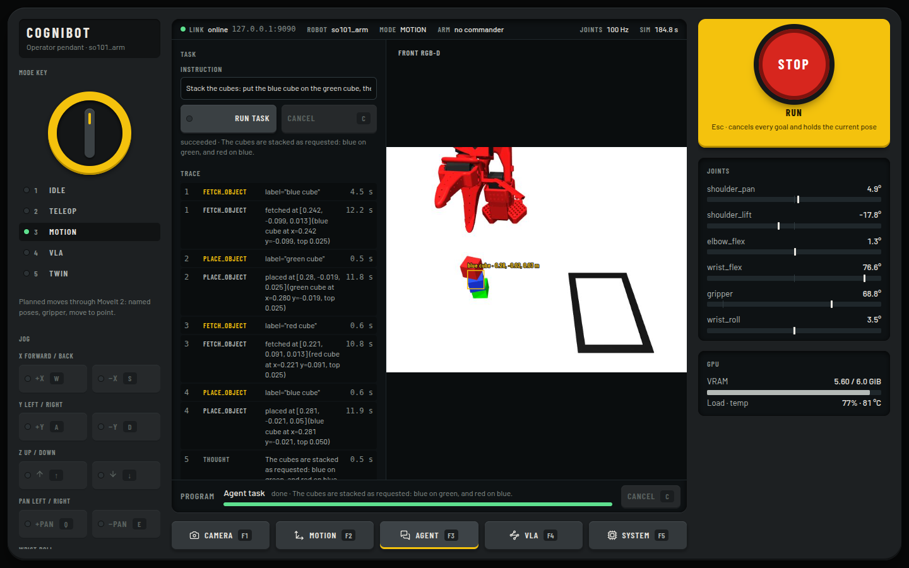
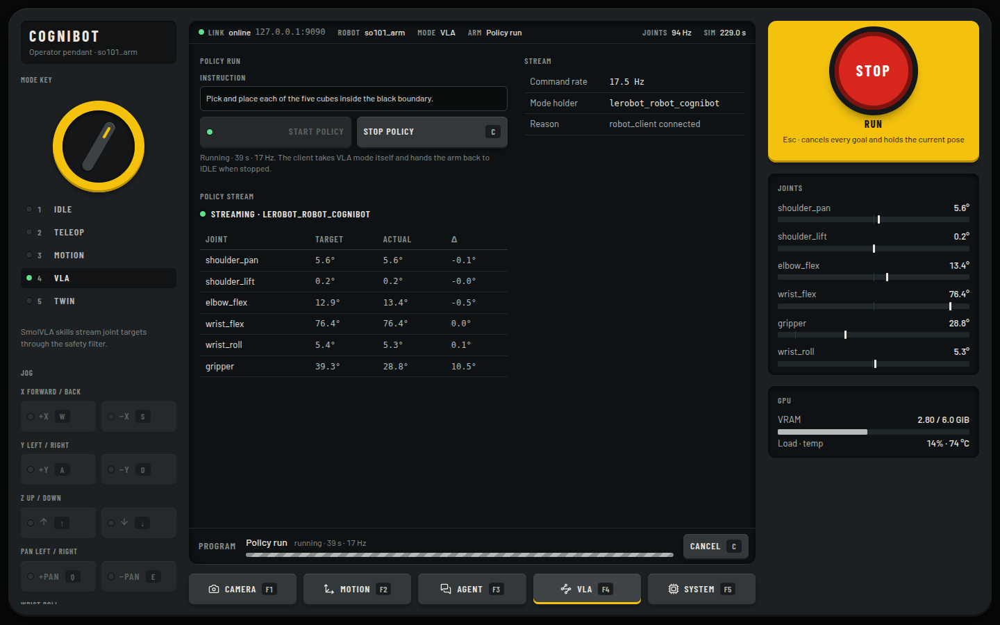
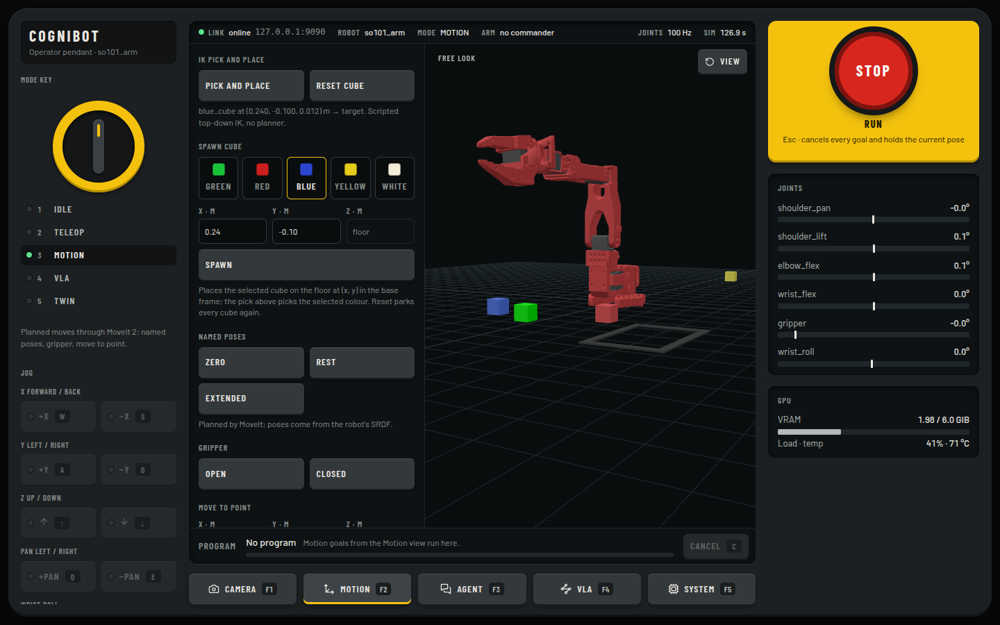
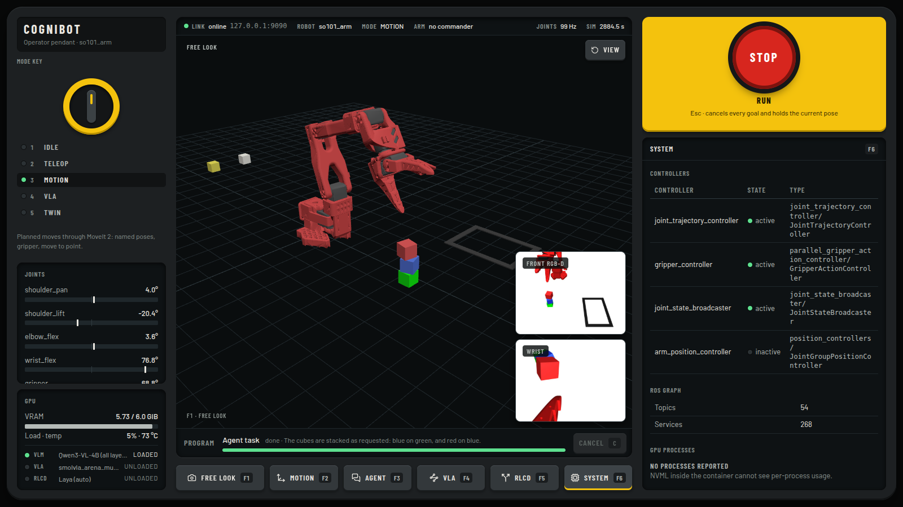
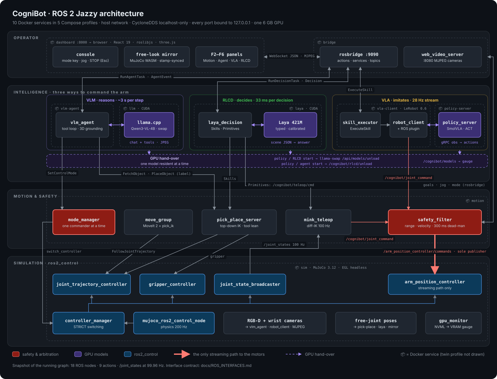
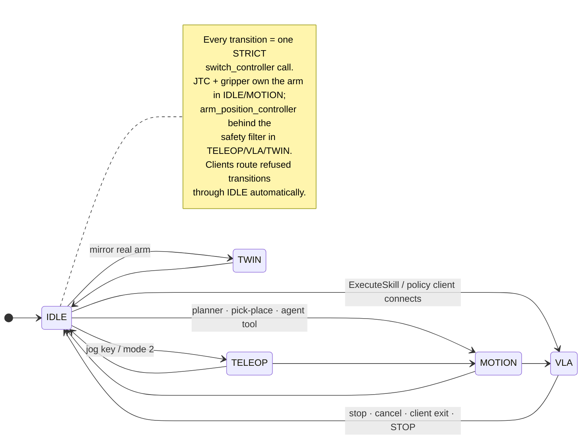
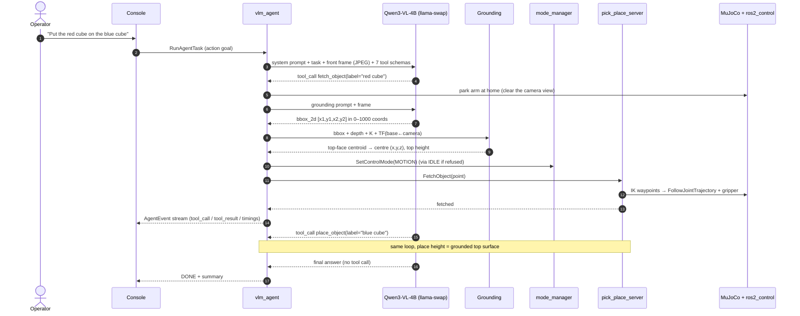

<div align="center">

# CogniBot

### Tell a robot arm what to do in plain language. It looks, reasons, grounds and acts, entirely on a 6 GB laptop GPU.

A containerized **ROS 2 Jazzy** manipulation stack that connects a local **vision-language model** (Qwen3-VL-4B on llama.cpp), **LeRobot visuomotor policies** (SmolVLA / ACT), **MoveIt 2** and a **MuJoCo**-simulated SO-101 arm. Control-mode arbitration and a streaming safety filter sit between every commander and the motors, and a teach-pendant web console drives all of it.

[](https://github.com/VIGNESHM-ENGR/CogniBot-Ros2-Vla/actions/workflows/ci.yml)


<sub>The operator console right after the agent executed <i>"Stack the cubes: put the blue cube on the green cube, then the red cube on top of the blue cube."</i> Free-look 3D mirror (MuJoCo WASM), front RGB-D and wrist cameras, live joints, VRAM gauge, and the latching STOP.</sub>

</div>

---

## Contents

[What it does](#what-it-does) · [Why this project](#why-this-project) · [Architecture](#architecture) · [Engineering decisions](#engineering-decisions) · [Hard problems solved](#hard-problems-solved) · [Measured results](#measured-results) · [Quick start](#quick-start-docker) · [Repository](#repository-layout) · [Status](#status-and-roadmap) · [Docs](#documentation)

## What it does

| | |
|---|---|
| 🗣️ **Language → action** | Type *"put the blue cube on the green cube, then the red cube on top"*. Qwen3-VL-4B looks at the camera, plans with seven robot tools, grounds each object to a 3D point from depth (≈ 1 mm error), and the arm executes through the same servers the operator uses. Every thought, tool call and result streams live to the console. |
| 🧠 **Learned policies** | LeRobot SmolVLA / ACT checkpoints run in LeRobot's async policy server and stream joint targets at up to 30 Hz, started and stopped from the browser, with the VLM unloaded from the GPU first. |
| 🦾 **Classical motion** | MoveIt 2 with pick_ik for planning, mink differential IK for Cartesian jogging, and scripted top-down pick-and-place with a reach-aware tool lean. |
| 🛡️ **One commander at a time** | A mode manager switches ros2_control controllers so exactly one source (teleop, planner, policy, twin) owns the arm. Streamed commands pass a safety filter enforcing joint range, velocity and a 300 ms dead-man. |
| 🧮 **Decision layer (RLCD)** | Laya, a 421M calibrated text classifier, decides over the scene as JSON: **Skills** (which skill and object, run by the scripted actions) or **Primitives** (one 2 cm motion per step, jogged through the teleop IK and the safety filter). It never sees an image and never emits a joint angle. Measured honestly: Primitives choose a gap-closing motion 23/24 times; Skills still fail the empty-gripper decision zero-shot ([ADR-0008](docs/adr/0008-laya-decision-layer.md)). |
| 🖥️ **Teach-pendant console** | A React operator console over rosbridge: the camera viewport never leaves the screen (F1 cycles free look / front / wrist), and F2–F6 load Motion, Agent, VLA, RLCD or System controls beside the STOP button, so the robot is watched while it is operated. Mode key, joints and GPU on the left, STOP on Esc, agent detections drawn on the live feed. |
| 📦 **Reproducible** | Nine Docker services in five Compose profiles. Every image digest, model revision, pip and npm version is pinned, and a GPU-free CI pipeline runs on every push. `./start.sh` brings it up; Ctrl-C takes everything down. |

<p><br><sub><b>The pendant.</b> The viewport never leaves the centre (F1 cycles free look, front and wrist); F2–F6 load a control panel under STOP. Here the RLCD panel runs a <b>Primitives</b> task in TELEOP: the guard questions clear, then each 2 cm motion is shown with every option the decision model scored.</sub></p>

<table>
<tr>
<td width="50%"><br><sub><b>Agent panel.</b> The model's plan as it ran: <code>fetch_object("blue cube")</code> → <code>place_object("green cube")</code> → <code>fetch_object("red cube")</code> → <code>place_object("blue cube")</code>, with per-step model and tool latency. The grounded box is drawn on the front camera.</sub></td>
<td width="50%"><br><sub><b>VLA panel.</b> A SmolVLA checkpoint streaming through the safety filter: mode holder, command rate, target vs. actual joint angles, and Start/Stop wired to a ROS 2 action.</sub></td>
</tr>
<tr>
<td width="50%"><br><sub><b>Motion panel.</b> MoveIt named poses, gripper and move-to-point, scripted pick-and-place, and a cube spawner (colour plus x, y) for building test scenes live.</sub></td>
<td width="50%"><br><sub><b>System panel.</b> ros2_control controller states as the mode manager switches them, ROS graph size, and per-process GPU memory.</sub></td>
</tr>
</table>

## Why this project

Small VLMs and VLAs now fit on a consumer GPU. Putting them on a robot is still a systems problem, not a modelling problem:

- **Dependency conflicts.** ROS 2 Humble ships Python 3.10; LeRobot needs 3.12+. MoveIt's Python bindings segfault against NumPy 2, which LeRobot requires.
- **One GPU, three tenants.** A physics simulator with cameras, a 4B VLM and a 450M VLA all want the same 6 GB.
- **Many commanders, one arm.** Teleop, a motion planner, a learned policy and an LLM agent will fight for the motors unless something arbitrates.
- **Learned policies have no safety model.** They emit raw joint targets at 30 Hz.
- **Small models make unreliable agents.** A 4B model mis-formats tool calls, reuses stale numbers and hallucinates success.

CogniBot is my answer to *"what does the software around a robot foundation model actually need to be?"* It is deliberately an **integration project**: mature open-source components (MuJoCo Menagerie, mujoco_ros2_control, MoveIt 2, mink, LeRobot, llama.cpp, rosbridge) pinned and composed, with custom code only where nothing upstream exists: arbitration, safety, the agent's tool layer and grounding, and the operator console.

## Architecture

### System: containers, ROS nodes and interfaces

<p align="center"></p>

Every container shares the host network with **CycloneDDS pinned to localhost** (no multicast, no bridge-network discovery issues), and every port binds to `127.0.0.1`. Red nodes are the safety layer. The thick arrow is the only way a streamed command reaches the motors: `mink_teleop` and the LeRobot client publish `/cognibot/joint_command`, and **only `safety_filter` publishes to the position controller**.

<details>
<summary><b>Live ROS graph</b> (<code>ros2 node list</code> / <code>action list</code> / <code>service list</code> on the running stack)</summary>

```text
## nodes (excluding transient helpers)
/controller_manager            /joint_state_broadcaster     /joint_trajectory_controller
/gripper_controller            /arm_position_controller     /mujoco_ros2_control_node
/robot_state_publisher         /gpu_monitor                 /move_group
/mode_manager                  /safety_filter               /mink_teleop
/pick_place_server             /vlm_agent                   /skill_executor
/rosbridge_websocket           /web_video_server

## actions
/cognibot/agent/run_task                              cognibot_interfaces/action/RunAgentTask
/cognibot/fetch_object                                cognibot_interfaces/action/FetchObject
/cognibot/place_object                                cognibot_interfaces/action/PlaceObject
/cognibot/vla/execute_skill                           cognibot_interfaces/action/ExecuteSkill
/move_action                                          moveit_msgs/action/MoveGroup
/execute_trajectory                                   moveit_msgs/action/ExecuteTrajectory
/joint_trajectory_controller/follow_joint_trajectory  control_msgs/action/FollowJointTrajectory
/gripper_controller/gripper_cmd                       control_msgs/action/ParallelGripperCommand

## services (project + key upstream)
/cognibot/set_mode                                    cognibot_interfaces/srv/SetControlMode
/cognibot/vlm/get_object_coordinates                  cognibot_interfaces/srv/GetObjectCoordinates
/cognibot/sim/reset_objects                           std_srvs/srv/Trigger
/controller_manager/switch_controller                 controller_manager_msgs/srv/SwitchController
/mujoco_ros2_control_node/set_free_joint_state        mujoco_ros2_control_msgs/srv/SetFreeJointState

## topics (project + key upstream)
/cognibot/joint_command        sensor_msgs/JointState                  → safety_filter
/arm_position_controller/commands  std_msgs/Float64MultiArray          ← safety_filter only
/cognibot/mode                 cognibot_interfaces/ControlMode         (transient local)
/cognibot/safety/status        diagnostic_msgs/DiagnosticArray
/cognibot/agent/events         cognibot_interfaces/AgentEvent
/cognibot/agent/detections     cognibot_interfaces/ObjectDetection
/cognibot/teleop/cmd           cognibot_interfaces/TeleopCommand
/cognibot/gpu                  cognibot_interfaces/GpuStatus
/joint_states                  sensor_msgs/JointState                  average rate: 99.96 Hz
/object_poses/free_joint_states mujoco_ros2_control_msgs/FreeJointStateArray
/mujoco_camera_plugin/front_rgbd/{color,depth,camera_info}
```

The full contract, including message definitions, is in [docs/ROS_INTERFACES.md](docs/ROS_INTERFACES.md). Interfaces change doc-first, in the same commit as the `.msg`/`.srv`/`.action` file.
</details>

### Control-mode arbitration



### A language task, end to end



## Engineering decisions

Each decision has an ADR or DEVLOG entry with the rejected options and a *revisit if* condition.

| Decision | Why | Rejected alternative | Record |
|---|---|---|---|
| **ROS 2 Jazzy**, not Humble | Python 3.12 is required by LeRobot 0.6; Jazzy is the LTS on Ubuntu 24.04 | Humble with a side-car Python: two interpreters talking over IPC for no gain | [ADR-0001](docs/adr/0001-jazzy-over-humble.md) |
| **One container per concern**, Compose profiles | The VLA venv needs NumPy 2 while MoveIt's bindings need NumPy 1.26; the CUDA images are 12 GB and optional | A monolithic image: unsolvable ABI conflict and 20+ GB rebuilds | [ADR-0002](docs/adr/0002-split-containers.md) |
| **Two-tier motion**: mink for teleop, MoveIt 2 + pick_ik for planning | A 5-DOF arm cannot track 6-D Servo twists; mink's task weighting degrades orientation gracefully at 100 Hz | MoveIt Servo for everything | [ADR-0003](docs/adr/0003-mink-plus-moveit.md) |
| **Arbitration by controller switching** | Ownership is enforced by ros2_control itself (STRICT switch), not by convention between nodes | A software mux: a crashed node can leave a stale publisher driving the arm | [ARCHITECTURE §6](docs/ARCHITECTURE.md) |
| **Single-publisher safety filter** on the streaming path | Policies and teleop never touch the controller directly; limits, velocity and dead-man live in one place | Per-producer clamping: N places to get safety wrong | [DEVLOG](docs/DEVLOG.md) |
| **CycloneDDS, host network, localhost only** | Eight containers discover each other deterministically, with no multicast storms on Wi-Fi and nothing exposed off-box | Docker bridge networks with DDS discovery servers | [ADR-0004](docs/adr/0004-cyclonedds-host-network.md) |
| **Qwen3-VL-4B on llama.cpp behind llama-swap** | Native 2D grounding plus tool-call templates in ≈ 4 GB; GPU, hybrid and CPU offload profiles and an unload API to hand the GPU to the VLA | vLLM (pre-allocates VRAM), Ollama (less control), SmolVLM2 (weak grounding) | [ADR-0005](docs/adr/0005-llamacpp-llamaswap-qwen3vl.md) |
| **Thin `openai` tool loop**, not an agent framework | The job is 7 tools, 12 steps, 1 repair retry; 16 dependencies vs 123 for RAI (LangChain, LangGraph, two OpenCV builds) | RAI, LangGraph | [ADR-0007](docs/adr/0007-agent-runtime.md) |
| **Tools take object labels, not coordinates** | The 4B model reused pre-move coordinates even when told they were stale; now grounding happens inside the tool, right before acting | Prompt rules; tool results restating new positions (both measured to fail) | [DEVLOG · stacking](docs/DEVLOG.md) |
| **Stock LeRobot async inference** + a thin robot plugin | Upstream gRPC server and client with action chunking; our code is only a `Robot` subclass over rclpy (~200 lines) | lerobot-ros (pins lerobot < 0.5, hard-coded topics), a custom inference node | [INTEGRATIONS](docs/INTEGRATIONS.md) |
| **Integrate, don't invent; pin everything** | Image digests, HF revisions, exact pip/npm versions: a clean clone reproduces the stack | Floating tags: silent breakage | [ADR-0006](docs/adr/0006-integrate-dont-invent.md) |

## Hard problems solved

These are the non-obvious ones, taken from the [engineering devlog](docs/DEVLOG.md), where each has a symptom → root cause → fix → evidence row.

<details open>
<summary><b>1. The LLM agent that confidently lied about stacking</b></summary>

A double stack ended with the red cube on the table while the model reported success. The trace showed `place_object` receiving the blue cube's **pre-move** coordinates. A prompt rule ("coordinates go stale") didn't help. A tool result that stated the new position didn't help either: the model took the new height but kept the old x, y. **Fix:** change the tool contract so `fetch_object("red cube")` and `place_object("blue cube")` ground the label themselves, immediately before moving, and coordinates never pass through the model. Double stack went from 0/3 to 3/3.
</details>

<details>
<summary><b>2. 9 mm of grounding bias, enough to miss every grasp</b></summary>

With the 2D box centre plus median depth, the grasp landed 9 mm toward the camera on a 25 mm cube: an oblique camera sees the top face **and** a side face. **Fix:** deproject every pixel in the box into the base frame, keep the highest 4 mm slab (the top face) and take a per-axis median, using the whole box because cropping trims the far edge and reintroduces the bias. Error dropped to ≈ 1 mm, covered by a synthetic oblique-camera unit test.
</details>

<details>
<summary><b>3. "Out of reach" was physics, not a solver bug</b></summary>

Placing on two stacked cubes failed at every hover height. Measured: holding the gripper vertical at z = 0.10 m and r = 0.28 m needs the wrist pivot 0.31 m from the shoulder, but the upper arm and forearm total 0.25 m, so vertical IK misses by 55–80 mm. **Fix:** the IK tries tool leans of 0°, 30° and 45° away from the base and takes the first within tolerance. The 30° lean reaches every stacking height with 0 mm error.
</details>

<details>
<summary><b>4. A policy that took the arm and never moved it</b></summary>

The SmolVLA client connected, held VLA mode and streamed 0 Hz. The server logged `KeyError 'observation.images.side'`. LeRobot's async server resizes camera images by looking the robot's key up in the policy's input features **before** the preprocessor's rename step runs, and the client sends an empty rename map that overrides that step anyway. **Fix:** map ROS camera topics directly onto the checkpoint's own feature names, read units from the checkpoint's normaliser statistics rather than its model card, and have the skill executor abort after 30 s without actions with the likely cause.
</details>

<details>
<summary><b>5. Wrist-roll jog that yawed the base instead</b></summary>

The jog key rotated the target about the end-effector site's local z. In the IK model that site is oriented differently from the scene's (a Menagerie quaternion), so "roll" was actually a yaw that only `shoulder_pan` could produce. **Fix:** roll about the last joint's world axis. Verified in the browser: +74° wrist roll, other joints within 10°.
</details>

<details>
<summary><b>6. Two GPUs' worth of models on one 6 GB card</b></summary>

The simulator with cameras (≈ 0.6 GB), Qwen3-VL-4B (≈ 4 GB) and a SmolVLA server (≈ 2 GB) don't fit together comfortably. **Fix:** llama-swap profiles plus an idle TTL, and the skill executor calls `POST /api/models/unload` before starting a policy, so each model has the GPU when it needs it. While a policy holds the arm, the agent automatically switches to the hybrid (RAM offload) profile.
</details>

<details>
<summary><b>7. More, briefly</b></summary>

- **MoveItPy segfaults** after installing ML packages: apt-built extensions link NumPy 1.26's ABI, so the core venv pins 1.26.4 and LeRobot (NumPy 2) lives in a separate image.
- **Model download killed mid-flight:** llama-swap's 5-minute health check terminated `llama-server -hf` during a 2.5 GB download. Models are now pre-fetched at a pinned revision.
- **Cube jitter in the browser:** arm and object poses arrive on separate rosbridge queues. Both are buffered and interpolated at a common simulation timestamp.
- **Console locked in VLA:** direct VLA → MOTION is not allowed by the mode table. Clients retry through IDLE instead of loosening the safety contract.
- **Launch tests flaking:** a running simulation on the same DDS domain made controller tests fail; tests run with the stack down.
</details>

## Measured results

ASUS TUF F15: RTX 3060 Laptop (6 GB), Intel i5-11400H (6 cores), 40 GB RAM, with the simulation running.

| What | Result |
|---|---|
| Agent: *"pick up the green cube and place it inside the black rectangle"* | **4/4** succeeded (including a reworded prompt and a different cube colour), ≈ 25 s per task |
| Agent: three-cube stack (blue on green, red on blue) | **3/3** succeeded, ≈ 48 s; final heights 0.012 / 0.037 / 0.062 m |
| Grounding error, 25 mm cube, oblique RGB-D | **≈ 1 mm** (top-face slab) vs 9 mm (box centre + median depth) |
| Qwen3-VL-4B Q4_K_M, turn with image + tool schema | GPU **3.0 s**, 1212 tok/s prompt, **66.6 tok/s** generation · hybrid 6.2 s / 7.9 tok/s · CPU 15.2 s / 4.0 tok/s |
| Policy streaming through the safety filter | 22–30 Hz commands; ACT inference 11 ms per 50-action chunk; SmolVLA (uncompiled) 331 ms per chunk, ≈ 2 GB VRAM |
| Simulation | `/joint_states` 99.96 Hz, cameras 640×480 at ≥ 15 Hz, headless on EGL |
| Tests | 49 ROS 2 tests (unit + launch_testing, GPU) · 29 dashboard unit tests · 19 agent/VLA tests in-image · GPU-free CI on every push |

**Honest limits.** None of the ~140 community SmolVLA/ACT SO-101 checkpoints I surveyed completes *this* scene's task, because they were trained with the camera on the opposite side of the table. The policy pipeline is verified end to end, but a policy that solves the scene needs a matching camera or a fine-tune (a scripted episode recorder is included). The safety filter enforces joint limits, velocity and a dead-man today; sphere-based collision checking is the next milestone.

## Quick start (Docker)

**Requirements:** Ubuntu 24.04, Docker with Compose v2, an NVIDIA GPU with the [NVIDIA Container Toolkit](https://docs.nvidia.com/datacenter/cloud-native/container-toolkit/install-guide.html), and about 40 GB of disk for images and models. Host preparation (EGL, DDS buffers): [docs/SETUP.md](docs/SETUP.md).

```bash
git clone https://github.com/VIGNESHM-ENGR/CogniBot-Ros2-Vla.git && cd CogniBot-Ros2-Vla
make env                 # cognibot_ws/docker/.env with your UID/GID
make build-all           # core · vlm · vla · dashboard images

# models (one time, pinned revisions, into ~/.cache/huggingface)
cognibot_ws/docker/llm/download_model.sh                                        # Qwen3-VL-4B GGUF, ≈ 3 GB
cognibot_ws/src/cognibot_vla/scripts/download_checkpoints.sh smolvla_arena_multitask smolvlm2_backbone

./start.sh               # everything; opens http://127.0.0.1:8000 — Ctrl-C stops all containers
```

| Command | Brings up |
|---|---|
| `./start.sh core` | Simulation, MoveIt, safety, bridge, console (no GPU models) |
| `./start.sh vlm` | + llama-swap and the language agent (Agent panel, F3) |
| `./start.sh vla` | + LeRobot policy server and skill executor (VLA panel, F4) |
| `make rlcd` | + the Laya decision layer (RLCD panel, F5); checkpoints from `cognibot_ws/docker/laya/download_checkpoints.sh` |
| `./start.sh` / `full` | All nine services |
| `make demo` · `make moveit` | Native MuJoCo viewer with a scripted pick-and-place · RViz MotionPlanning |
| `make test` | Every ROS 2 test in the core image (run with the stack down) |
| `make down` | Stop every profile |

### Driving the console

The centre screen always shows the robot; the soft keys only change what is beside it.

| Key | Where | What happens |
|---|---|---|
| **F1** (or V) | centre viewport | Cycle free-look 3D mirror → front RGB-D → wrist camera; the other two stay as insets |
| **F2** Motion | panel under STOP | MoveIt named poses, gripper, move-to-point, **Pick and place**, **Spawn cube** (colour + x, y), reset |
| **F3** Agent | panel under STOP | Type a task, then watch every tool call; grounded boxes appear on the front feed |
| **F4** VLA | panel under STOP | Start/Stop a LeRobot policy; live rate and target-vs-actual joints |
| **F5** RLCD | panel under STOP | Pick **Skills** or **Primitives**, run a task, and see every option the decision model scored with its probability and whether it acted or escalated |
| **F6** System | panel under STOP | Controllers, ROS graph, GPU processes |
| Jog | keyboard, mode 2 | W/S ±X, A/D ±Y, ↑/↓ ±Z, Q/E base pan, ←/→ wrist roll, G gripper — through mink IK and the safety filter |

**Esc** is STOP: it cancels every goal and holds the pose, and **R** releases it. The mode key (1–5) decides who owns the arm.

## Repository layout

```text
cognibot_ws/
  docker/                 Dockerfile (interfaces · core · vlm · vla · tools), compose, CycloneDDS, llama-swap config
  src/
    cognibot_interfaces/  msgs · srvs · actions (AgentEvent, ControlMode, RunAgentTask, ExecuteSkill, FetchObject …)
    cognibot_common/      robot registry, QoS presets, MJCF tinting, GPU monitor
    cognibot_sim/         MuJoCo scenes + SO-101 / Panda descriptions, ros2_control configs, sim launch
    cognibot_motion/      mode_manager, safety_filter, pick_place_server (+ pure IK module), MoveIt launch
    cognibot_teleop/      mink_teleop and pure teleop math
    cognibot_vlm/         grounding, tool schemas, agent loop, vlm_agent node, prompts
    cognibot_vla/         skill_executor, LeRobot robot plugin, checkpoint + episode scripts
    cognibot_bringup/     launch composition per service
  third_party.repos       vcstool pins for upstream ROS sources
dashboard/                Vite + React + TypeScript operator console (roslibjs, three.js, MuJoCo WASM)
docs/                     architecture, interfaces, integrations, VRAM budget, ADRs, devlog, media
start.sh · Makefile       one-command start/stop and developer targets
```

## Status and roadmap

| Phase | Scope | Status |
|---|---|---|
| P0 | Foundation: repo, interfaces, Docker/Compose, CI | ✅ done |
| P1 | Headless MuJoCo SO-101 / Panda, ros2_control, RGB-D cameras, TF | ✅ done |
| P2 | MoveIt 2 + pick_ik, mink teleop, mode manager, safety filter, pick-and-place | ✅ working · collision spheres and REACH study next |
| P3 | Teach-pendant web console | ✅ working · accessibility polish open |
| P4 | Qwen3-VL tool-calling agent with 3D grounding | ✅ working in simulation · 30-scene evaluation open |
| P5 | LeRobot SmolVLA/ACT inference with a VRAM handoff | 🟡 pipeline verified · no checkpoint yet solves this scene |
| P6 | Digital twin with a real SO-101 (feetech_ros2_driver) | ⏳ planned |
| P7 | Benchmarks, demo video, v1.0 | ⏳ planned |

Details: [PROJECT_PLAN](docs/PROJECT_PLAN.md) · [PROJECT_SCOPE](docs/PROJECT_SCOPE.md) · [CHANGELOG](CHANGELOG.md)

## Documentation

| Doc | Contents |
|---|---|
| [ARCHITECTURE](docs/ARCHITECTURE.md) | Services, packages, robot registry, control modes, data flows, safety geometry, frames |
| [ROS_INTERFACES](docs/ROS_INTERFACES.md) | Every topic, service and action, with the custom message definitions |
| [DEVLOG](docs/DEVLOG.md) | Engineering log: problems with root causes, decision trees, measurements |
| [ADRs](docs/adr/README.md) | Seven architecture decision records |
| [INTEGRATIONS](docs/INTEGRATIONS.md) | Every upstream component with its pin and the alternatives considered |
| [VRAM_BUDGET](docs/VRAM_BUDGET.md) · [NETWORKING](docs/NETWORKING.md) · [SETUP](docs/SETUP.md) | GPU budget, DDS/ports/QoS, host preparation |

## Built on

[MuJoCo](https://github.com/google-deepmind/mujoco) & [Menagerie](https://github.com/google-deepmind/mujoco_menagerie) · [mujoco_ros2_control](https://github.com/ros-controls/mujoco_ros2_control) · [so101-nexus](https://github.com/johnsutor/so101-nexus) · [MoveIt 2](https://moveit.ai) · [pick_ik](https://github.com/PickNikRobotics/pick_ik) · [mink](https://github.com/kevinzakka/mink) · [LeRobot](https://github.com/huggingface/lerobot) · [llama.cpp](https://github.com/ggml-org/llama.cpp) · [llama-swap](https://github.com/mostlygeek/llama-swap) · [Qwen3-VL](https://github.com/QwenLM/Qwen3-VL) · [rosbridge_suite](https://github.com/RobotWebTools/rosbridge_suite) · [roslibjs](https://github.com/RobotWebTools/roslibjs) · [three.js](https://threejs.org). Licenses: [THIRD_PARTY_NOTICES.md](THIRD_PARTY_NOTICES.md).

## License

Apache-2.0 © Vignesh. Third-party components keep their own licenses.
