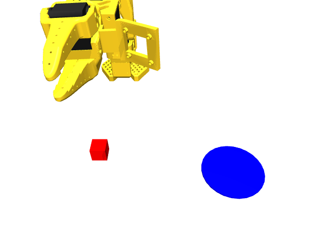

# Simulation Scenes

This directory contains simulation task scenes exported from upstream task environments for use with `mujoco_ros2_control` and downstream nodes (MoveIt 2, mink, VLM agent, SmolVLA policy).

## Scenes

### `so101_pick_and_place.xml`

Exported from [`so101-nexus`](https://github.com/johnsutor/so101-nexus) `MuJoCoPickAndPlace-v1` (version `0.6.0`).

- **Robot**: SO-101 6-DOF manipulator (Menagerie `robotstudio_so101` at commit `8161bba264d7fa7c99ca301e91e7fb44737676ad` with aligned `wrist_roll` range `[-2.74385, 2.84121]` and `gripperframe` site `[-0.0079, -0.000218, -0.098127]`).
- **Objects**:
  - `red_cube`: freejoint box body (size `0.0125` m half-size, mass `0.01` kg, rgba `[1, 0, 0, 1]`) at spawn pose `(0.274100, -0.019501, 0.012445)`.
  - `blue_target`: static cylinder target disc (radius `0.05` m, rgba `[0, 0, 1, 1]`) at spawn pose `(0.307045, 0.197373, 0.001000)`.
- **Cameras**:
  - `wrist_cam`: wrist-mounted camera on `camera_mount` body (`1920x1080`, `fovy=48.5`).
  - `front_rgbd`: fixed front tabletop camera framing the robot workspace, cube, and target disc (`640x480`, `fovy=48`, pos `[0.56, 0.08, 0.36]`, xyaxes `[0, 1, 0, -0.696, 0, 0.718]`).

### Preview



## Reproduction

To re-export the scene deterministically:

```bash
docker run --rm \
  -v $(pwd):/workspace \
  -w /workspace \
  cognibot/tools:dev \
  python3 cognibot_ws/src/cognibot_sim/scripts/export_nexus_scene.py
```
