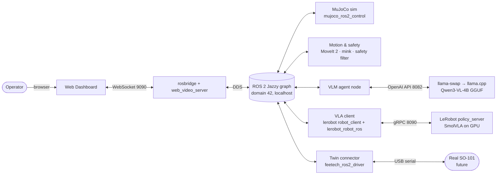
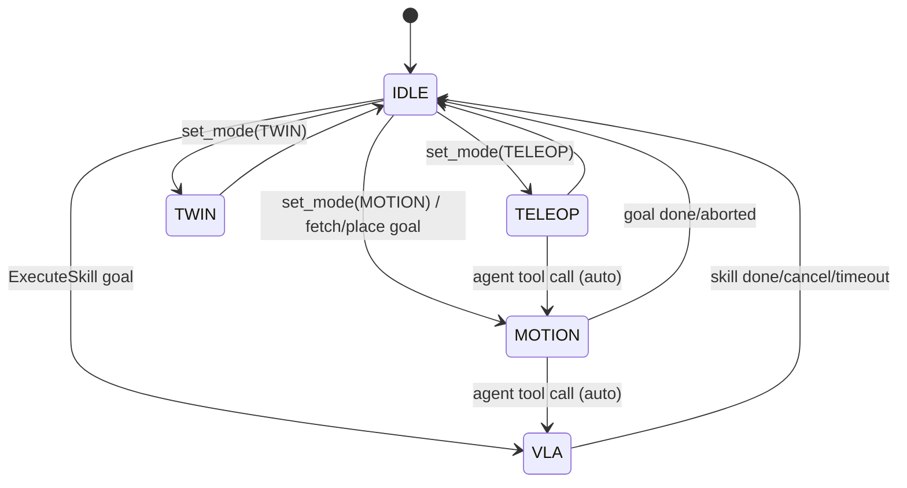
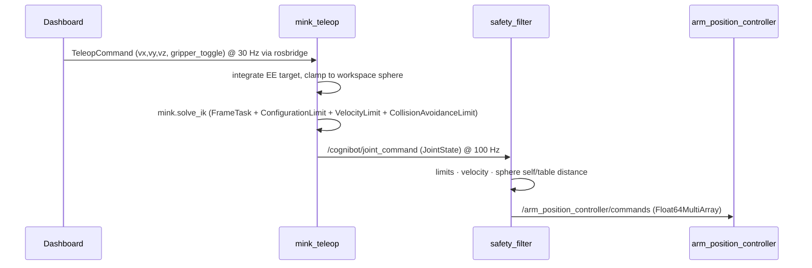
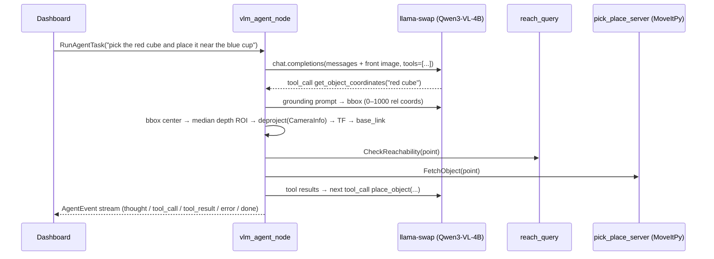
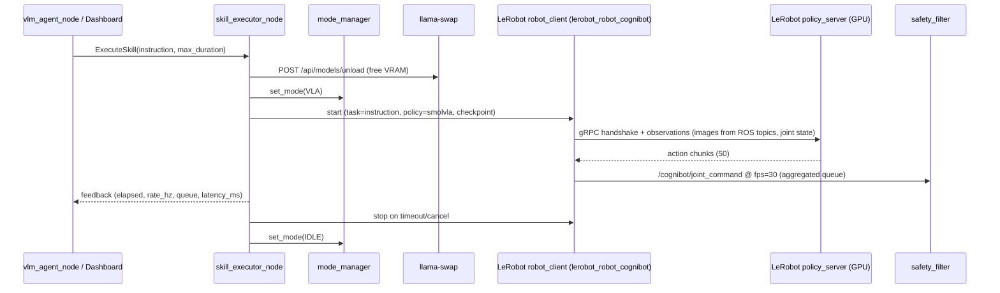
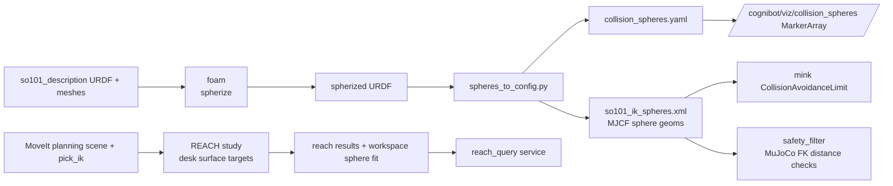

# Architecture: CogniBot-ROS2-VLA

Related: [PROJECT_SCOPE.md](PROJECT_SCOPE.md) · [NETWORKING.md](NETWORKING.md) · [ROS_INTERFACES.md](ROS_INTERFACES.md) · [INTEGRATIONS.md](INTEGRATIONS.md) · [VRAM_BUDGET.md](VRAM_BUDGET.md)

---

## 1. Design principles

1. **Integrate, don't invent.** Every capability comes from a maintained upstream component (MoveIt 2, mujoco_ros2_control, LeRobot, llama.cpp, foam, REACH). Our code is glue, and it stays small and tested. See [ADR-0006](adr/0006-integrate-dont-invent.md).
2. **One container per concern**, grouped by Compose profiles. The sim core runs alone; AI services are opt-in. See [ADR-0002](adr/0002-split-containers.md).
3. **Robot-agnostic by configuration.** Nodes never hard-code joint names; they read the robot registry (`robot:=so101|panda`).
4. **Single commander.** Exactly one control mode owns the arm at any time, enforced by ros2_control controller switching.
5. **Every streamed command passes the safety filter.** Learned policies and teleop never talk to controllers directly.
6. **Standard ROS 2 interfaces first.** Custom messages exist only where no standard type fits.

## 2. System context



## 3. Container and service map

| Service | Image (source) | Profile | GPU | Runs |
|---|---|---|---|---|
| `sim` | `cognibot/core` (FROM `moveit/moveit2:jazzy-release`) | core | yes (EGL) | `mujoco_ros2_control` `ros2_control_node`, `robot_state_publisher`, controller spawners, `gpu_monitor` |
| `motion` | `cognibot/core` | core | no | `move_group` (pick_ik), `mode_manager`, `safety_filter`, `mink_teleop`, `reach_query`, `pick_place_server` |
| `bridge` | `cognibot/core` | core | no | `rosbridge_websocket`, `web_video_server` |
| `dashboard` | `cognibot/dashboard` (node build → nginx) | core | no | static SPA on :8000 |
| `llm` | `ghcr.io/mostlygeek/llama-swap:unified-cuda13` (pinned) | `vlm`, `full` | yes | llama-swap → `llama-server` with Qwen3-VL-4B-Instruct Q4_K_M + mmproj |
| `vlm-agent` | `cognibot/vlm` (FROM `ros:jazzy-ros-base`) | `vlm`, `full` | no | `vlm_agent_node` |
| `policy-server` | `huggingface/lerobot-gpu` (pinned digest) | `vla`, `full` | yes | `python -m lerobot.async_inference.policy_server` (unmodified) |
| `vla-client` | `cognibot/vla` (FROM `ros:jazzy-ros-base` + venv LeRobot) | `vla`, `full` | no | `skill_executor_node` → LeRobot `robot_client` with the `lerobot_robot_cognibot` plugin |
| `twin` | `cognibot/core` | `twin` | no | second `controller_manager` under `/real` with `feetech_ros2_driver` (or mock hardware) + `twin_mirror` |

All ROS services share `network_mode: host`, `ipc: host`, `ROS_DOMAIN_ID`, `RMW_IMPLEMENTATION=rmw_cyclonedds_cpp` (see [NETWORKING.md](NETWORKING.md)).

## 4. Workspace packages (our code)

| Package | Build type | Responsibility |
|---|---|---|
| `cognibot_interfaces` | ament_cmake | Custom msg/srv/action (see [ROS_INTERFACES.md](ROS_INTERFACES.md)) |
| `cognibot_common` | ament_python | Robot registry loader, QoS presets, image ↔ numpy helpers, `gpu_monitor` node |
| `cognibot_sim` | ament_cmake | Robot registry (`robots/<name>/robot.yaml`), MJCF scenes, URDF/xacro with `<ros2_control>`, controller YAML, `sim.launch.py` |
| `cognibot_motion` | ament_python | `mode_manager`, `safety_filter`, `reach_query`, `pick_place_server` (MoveItPy), collision-sphere and REACH configs, MoveIt overrides (pick_ik) |
| `cognibot_teleop` | ament_python | `mink_teleop` node: `TeleopCommand` → EE target → mink IK → `/cognibot/joint_command` |
| `cognibot_vlm` | ament_python | `vlm_agent_node`, tool registry, grounding (bbox → 3D), llama-swap client |
| `cognibot_vla` | ament_python | `skill_executor_node` (`ExecuteSkill` action wrapping LeRobot `robot_client`); `lerobot_plugins/` (pip packages: `lerobot_robot_cognibot`, `lerobot_camera_ros2`) |
| `cognibot_twin` | ament_python | `twin.launch.py`, `twin_mirror` node (real `/real/joint_states` → sim streaming command) |
| `cognibot_bringup` | ament_cmake | `cognibot_bringup.launch.py` and per-service launch files, RViz config |

Third-party ROS sources (`so101_description`, `so101_moveit_config`, `feetech_ros2_driver`, `reach`, `reach_ros2`) are imported with vcstool from `cognibot_ws/third_party.repos` at image build time and are **not** vendored.

## 5. Robot registry

`cognibot_sim/robots/<robot>/robot.yaml` is the single source of truth every node reads through `cognibot_common.robot_registry`:

```yaml
name: so101
base_frame: base_link
ee_frame: gripper_frame_link        # URDF frame for MoveIt
ee_site: gripperframe               # MJCF site for mink
arm_joints: [shoulder_pan, shoulder_lift, elbow_flex, wrist_flex, wrist_roll]
gripper:
  joint: gripper
  open: 1.2
  closed: 0.0
home_pose: [0.0, -1.57, 1.57, 0.0, 0.0]
mjcf:
  scene: scenes/so101_pick_and_place.xml  # exported from so101-nexus MuJoCoPickAndPlace-v1, used by mujoco_ros2_control
  ik_model: robots/so101/mjcf/so101_ik_spheres.xml   # sphere geoms for mink + safety filter
urdf: robots/so101/urdf/so101_mujoco.urdf.xacro       # wraps so101_description + <ros2_control>
controllers: robots/so101/config/controllers.yaml
moveit:
  config_package: so101_moveit_config
  kinematics_override: config/so101/kinematics_pick_ik.yaml
cameras:
  front: {topic: /camera/front, frame: front_camera_optical_frame, depth: true}
  wrist: {topic: /camera/wrist, frame: wrist_camera_optical_frame, depth: false}
safety:
  collision_spheres: config/so101/collision_spheres.yaml
  min_distance: 0.01
  max_joint_velocity: 2.0           # rad/s
reach:
  study_dir: config/so101/reach/
  workspace_sphere: {center: [0.0, 0.0, 0.12], r_min: 0.08, r_max: 0.38}
vla:
  lerobot_robot_type: cognibot_so101
  checkpoint: lerobot/smolvla_base
```

Values shown are illustrative. Real values are produced in P1/P2 tasks.

## 6. Control modes and arbitration



`mode_manager` owns `/cognibot/set_mode` and publishes `/cognibot/mode` (transient-local). Each transition calls `/controller_manager/switch_controller` with `strictness=STRICT`:

| Mode | Active arm controller | Command source |
|---|---|---|
| IDLE | `joint_trajectory_controller` (holds position) | none |
| MOTION | `joint_trajectory_controller` + `gripper_controller` | MoveIt `move_group` via `FollowJointTrajectory` |
| TELEOP | `arm_position_controller` (`JointGroupPositionController`, arm + gripper) | `mink_teleop` → `safety_filter` |
| VLA | `arm_position_controller` | LeRobot `robot_client` → `safety_filter` |
| TWIN | `arm_position_controller` | `twin_mirror` → `safety_filter` |

The safety filter forwards only when `/cognibot/mode` matches the producer's declared mode, so a stale publisher from another mode is dropped.

## 7. Key data flows

### 7.1 Teleop (P2–P3)



Key mapping (dashboard): `W/S` ±X, `A/D` ±Y, `↑/↓` ±Z, `G` toggle gripper. A dead-man timeout of 300 ms zeroes velocity.

### 7.2 Language task through the VLM agent (P4)



Agent runtime: **RAI** (RobotecAI, Apache-2.0) if P4-T01 confirms it works with the llama-swap OpenAI-compatible endpoint on Jazzy. Our tools are then registered as RAI/LangChain tools. Fallback: a thin `openai` SDK tool loop in `vlm_agent_node`.

Tools exposed to the model: `get_object_coordinates(label)`, `check_reachability(x,y,z)`, `fetch_object(x,y,z)`, `place_object(x,y,z)`, `move_home()`, `set_gripper(state)`, `run_vla_skill(instruction, max_duration_s)`.

### 7.3 VLA skill (P5)



LeRobot's `robot_client` already does action-chunk queueing, the `chunk_size_threshold` refill and `aggregate_fn_name` blending. We don't reimplement any of it.

**Checkpoint sanity baseline:** before running a checkpoint through ROS, P5 evaluates it with stock `lerobot-eval` in the so101-nexus EnvHub env (no ROS involved). A policy that fails there won't succeed through ROS either, so this separates model problems from integration problems.

### 7.4 Digital twin (P6)

The `twin` container runs `feetech_ros2_driver` (or `hardware_type:=mock`) under namespace `/real`. `twin_mirror` relays `/real/joint_states` into sim through the safety filter in TWIN mode, so MuJoCo becomes a live digital twin. Dashboard WASD control stays available in TELEOP mode on the sim.

## 8. Safety geometry



- **Collision spheres:** [foam](https://github.com/CoMMALab/foam) converts link meshes into sphere sets. We convert its output into (a) an MJCF "IK model" with sphere geoms for fast MuJoCo distance queries in mink and the safety filter, and (b) YAML for visualization.
- **Reachability:** [REACH](https://github.com/ros-industrial/reach) + `reach_ros2` evaluate IK reachability and manipulability over a dense point cloud on the desk surface and above it. `reach_query` answers `CheckReachability` from the stored results (nearest-neighbour score) and falls back to the fitted workspace sphere (r_min/r_max shell) for points outside the study volume.

## 9. Camera and TF frames

```
world
└── base_link                      (robot base, fixed on desk)
    ├── … arm links …              (robot_state_publisher from /joint_states)
    │   └── gripper_frame_link
    │       └── wrist_camera_link → wrist_camera_optical_frame
    └── desk_link
front_camera_link → front_camera_optical_frame   (static TF from world, matches MJCF camera pose)
```

MJCF cameras and URDF/static TF frames must match. P1-T05 includes a test that reprojects a known MuJoCo body position into the image and checks the pixel error.

## 10. Failure handling

| Failure | Behavior |
|---|---|
| llama-swap unreachable | Agent returns `AgentEvent(error)`; manual teleop is unaffected |
| policy_server unreachable | `ExecuteSkill` aborts before switching mode |
| Safety filter rejects N consecutive commands | Publishes `/diagnostics` ERROR, requests `set_mode(IDLE)` |
| Teleop dead-man timeout | Zero velocity, hold position |
| Controller switch fails | Mode stays unchanged; service returns `success=false` with the reason |
| Sim not healthy | Compose `depends_on: condition: service_healthy` stops downstream services from starting |
