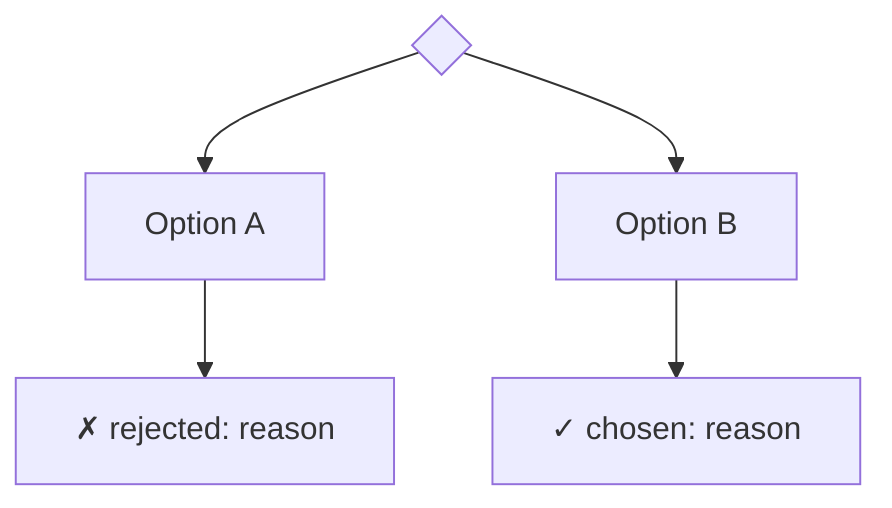
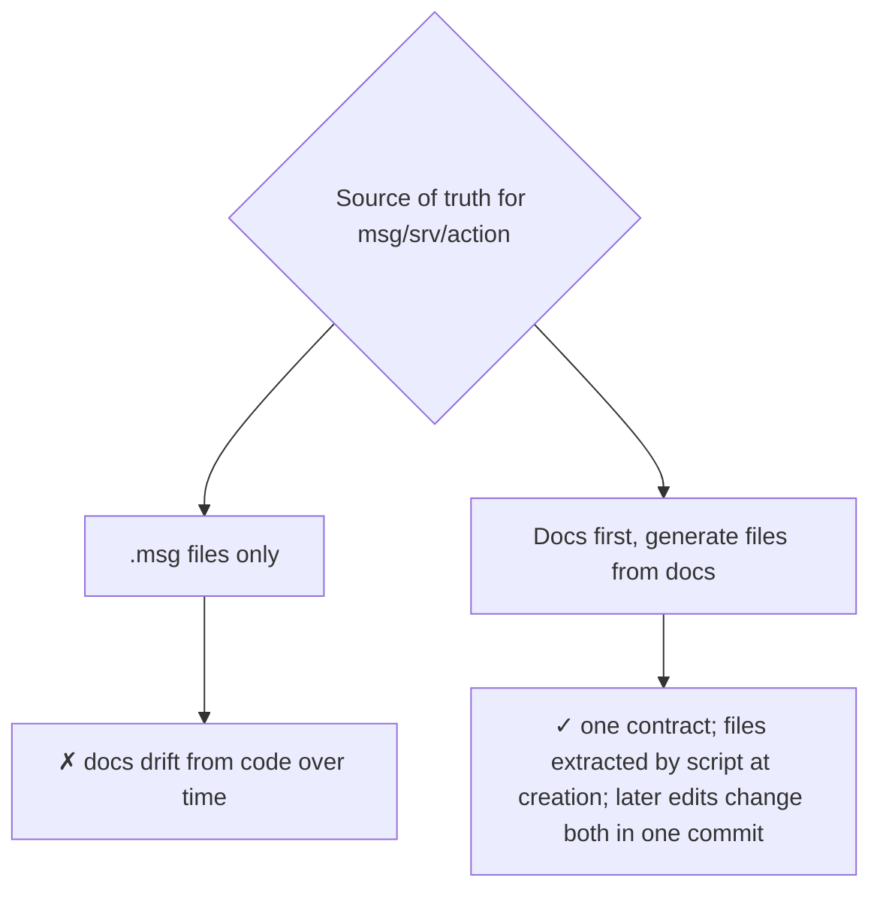
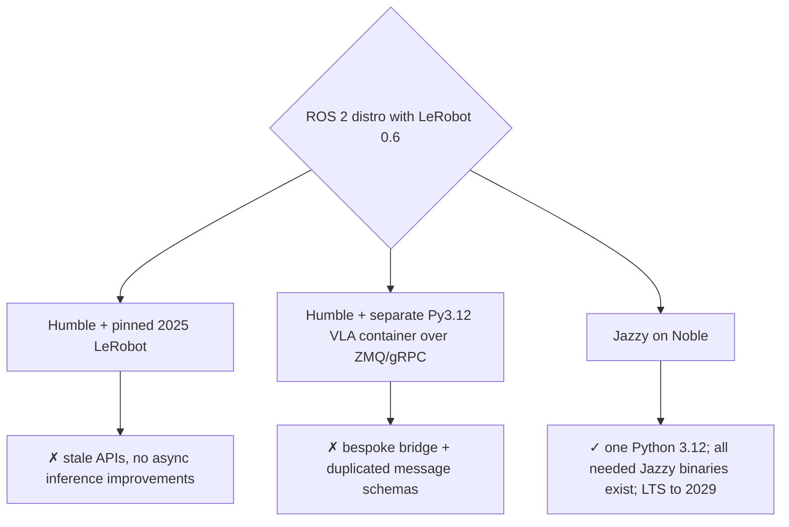
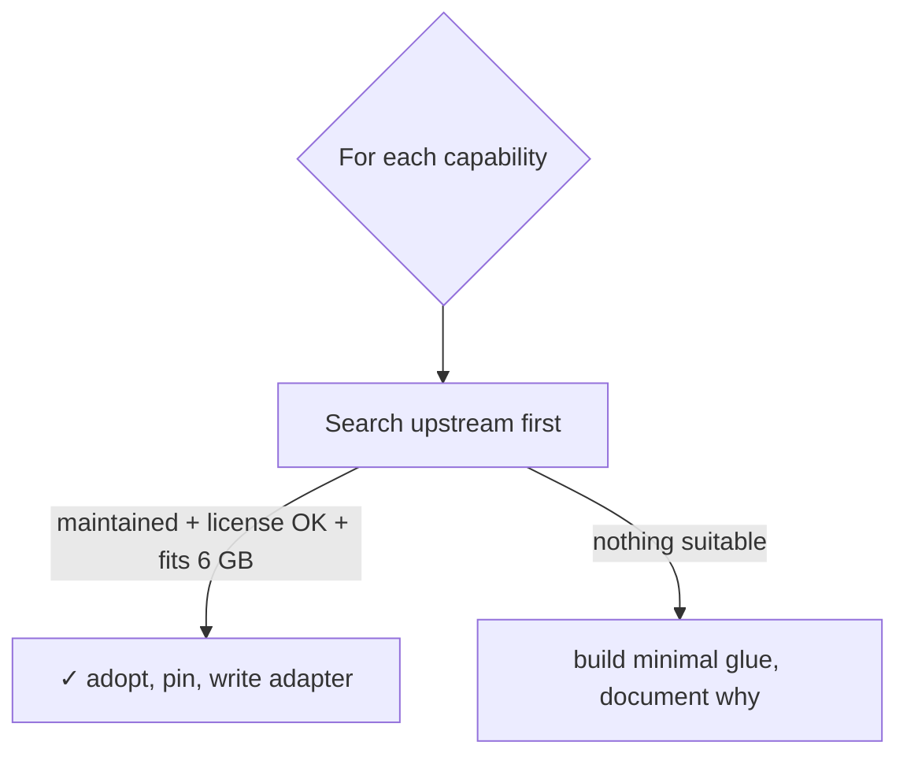
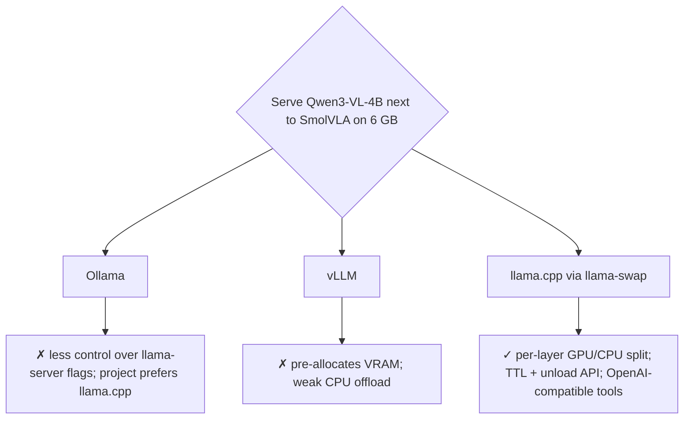
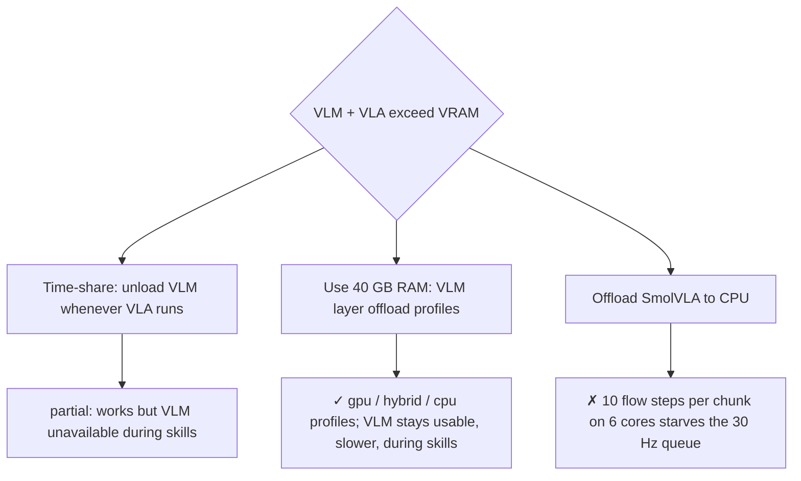
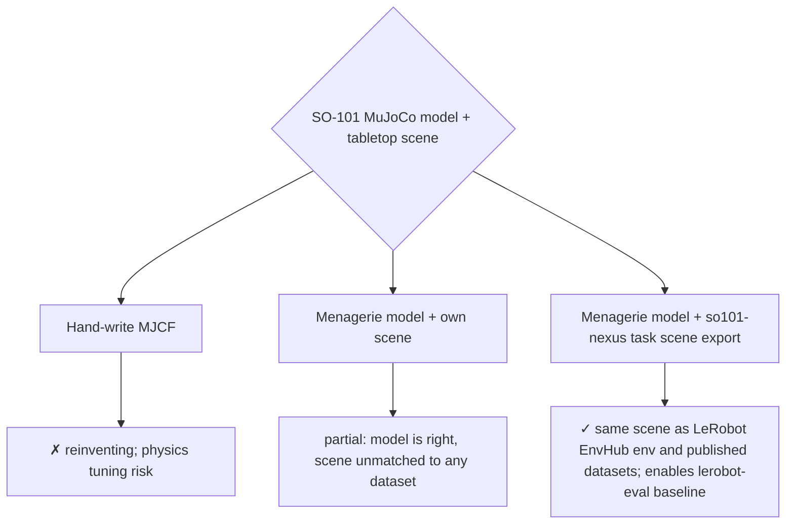
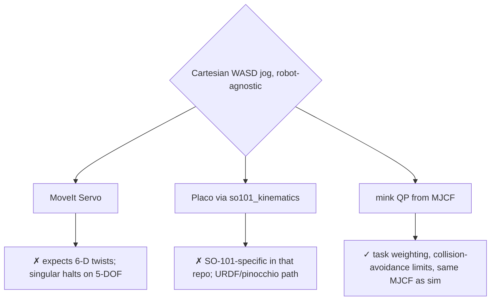
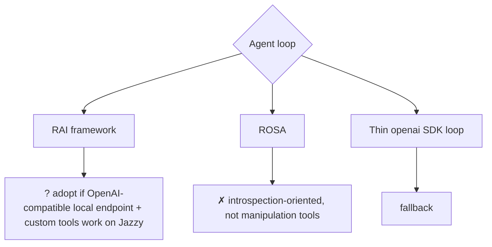

# Engineering Devlog: CogniBot-ROS2-VLA

The engineering log of the project: what was done, what broke, why, how it was fixed, and how decisions were reached.

| File | Answers |
|---|---|
| [CHANGELOG.md](../CHANGELOG.md) | *What* changed, for users |
| [ADRs](adr/README.md) | Significant, long-lived architecture decisions |
| **DEVLOG** (this file) | The **working narrative**: problems with root causes and solutions, decision trees (including small ones that don't need an ADR), dead ends, open questions |

## Rules

1. **One entry per task or work session**, newest first, added in the same commit as the work.
2. **Problems** always get a *symptom → root cause → solution → evidence* row. "It didn't work, tried something else" isn't enough.
3. **Decisions** get a small decision tree (mermaid). Rejected options stay visible, each with a reason and a "revisit if" condition.
4. **Promote** a decision to an ADR when it constrains other phases or is expensive to reverse. Link the ADR from the entry.
5. **Facts over opinions.** Include commands, versions, error messages, measured numbers, commit hashes and links.

## Index

| Date | ID | Title | Type |
|---|---|---|---|
| 2026-09-13 | P0-T04 | Workspace skeleton and interface package | build |
| 2026-09-13 | P0-T01…T03 | Research, architecture and integration strategy | planning |

---

## Entry template

Copy this block to the top of the entries section.

````markdown
## YYYY-MM-DD · <TASK-ID> · <short title>

**Context:** what was attempted and why (links to plan / issue / ADR).
**Outcome:** ✅ done | 🟡 partial | ⛔ blocked. Commits: `<hash>` …

### Work log
- Step-by-step notes of what was actually done (commands, files, versions).

### Problems → root cause → solution
| # | Symptom | Root cause | Solution | Evidence |
|---|---|---|---|---|
| 1 | exact error / observed behavior | why it happened | what fixed it | log line, test, link |

### Decisions
#### D1: <question being decided>

- **Chosen:** … because …
- **Rejected:** … because …
- **Revisit if:** …

### Measurements (optional)
| Metric | Value | How measured |
|---|---|---|

### Open questions / follow-ups
- [ ] …
````

---

# Entries

## 2026-09-13 · P0-T04 · Workspace skeleton and interface package

**Context:** create every ROS 2 package up front so later phases only add content ([ARCHITECTURE §4](ARCHITECTURE.md#4-workspace-packages-our-code)).
**Outcome:** ✅ done. Commit: `feat(ws): scaffold ROS 2 Jazzy packages and cognibot_interfaces`.

### Work log
- Generated 6 `ament_python` and 3 `ament_cmake` packages (`cognibot_interfaces`, `cognibot_sim`, `cognibot_bringup`).
- Extracted all 13 interface definitions **verbatim from `docs/ROS_INTERFACES.md`** with a regex over the fenced blocks, so documentation and generated code match at creation time.
- Added `third_party.repos` (vcstool) with commit pins and gitignored `cognibot_ws/src/third_party/`.
- Verified in `ros:jazzy-ros-base` (digest `sha256:386d06ec…`): `colcon build` → 9 packages; `ros2 interface list` shows all 13 interfaces; Python packages import.

### Problems → root cause → solution
| # | Symptom | Root cause | Solution | Evidence |
|---|---|---|---|---|
| 1 | (anticipated) `install(DIRECTORY launch …)` fails on skeleton packages | CMake errors when an installed directory doesn't exist yet, and empty directories can't be committed to git | `foreach(dir …) if(EXISTS …) install(…)` in data packages | `cognibot_sim` / `cognibot_bringup` build in 1 s |
| 2 | LeRobot plugin packages would be picked up by colcon | colcon scans any directory with `pyproject.toml`/`setup.py` | `COLCON_IGNORE` in `cognibot_vla/lerobot_plugins/` | build lists 9 packages only |

### Decisions
#### D1: Where do the custom interface definitions live first, docs or code?

- **Revisit if:** interfaces churn often. Then add a CI check that diffs docs blocks against the files.

---

## 2026-09-13 · P0-T01…T03 · Research, architecture and integration strategy

**Context:** turn the initial brief (Humble, Ollama/vLLM, custom SmolVLA node, custom teleop and mock driver) into a buildable, portfolio-grade plan for an RTX 3060 Laptop (6 GB VRAM), 40 GB RAM, i5-11400H, Ubuntu 24.04 host.
**Outcome:** ✅ done. Commits: `chore: initialize repository…`, `docs: add project scope, architecture…`.

### Work log
- Surveyed upstream docs and repositories: LeRobot `pyproject.toml`, SmolVLA config and async inference docs, ros-controls `mujoco_ros2_control` (README, index.ros.org releases), MuJoCo Menagerie, pick_ik, mink, foam, REACH, llama-swap, lerobot-ros, ROBOTIS zenoh plugin, RAI, ROSA.
- Surveyed the SO-101 ecosystem: so101-ros-physical-ai, adoodevv/so101_ros2, nimicurtis/so101_ros2, Pavankv92/lerobot_ws, MuRain37/so101-ros2-mujoco, so101-nexus, lerobot-env-so101, PhysAI starter.
- Queried the Hugging Face Hub for SmolVLA checkpoints and SO-101 **MuJoCo** datasets.
- Recorded pins for every component in [INTEGRATIONS.md](INTEGRATIONS.md).

### Problems → root cause → solution
| # | Symptom | Root cause | Solution | Evidence |
|---|---|---|---|---|
| 1 | The brief's stack (ROS 2 Humble + LeRobot SmolVLA) can't share one Python | LeRobot 0.6.2 declares `requires-python >= 3.12`; Humble on Jammy is Python 3.10, and rclpy is built against it | Move every ROS container to **Jazzy / Noble (3.12)** | [ADR-0001](adr/0001-jazzy-over-humble.md); LeRobot `pyproject.toml` |
| 2 | `mujoco_ros2_control` can't simulate the plain SO-101 URDF | The ros-controls plugin requires an MJCF (`mujoco_model` param); URDF→MJCF conversion is marked experimental | Use the Menagerie MJCF for physics and the upstream URDF only for `robot_description` and MoveIt, with a consistency test (planned P1-T03) | mujoco_ros2_control README |
| 3 | The LeRobot ROS plugin can't read ROS camera topics | `lerobot_robot_ros.ROS2Robot` builds cameras with LeRobot's `make_cameras_from_configs` (OpenCV/RealSense), with no ROS image camera type | Plan a small `lerobot_camera_ros2` plugin adapted from LeRobot PR #866 | `lerobot_robot_ros/robot.py` L20–L44 |
| 4 | (anticipated) ROS nodes in many containers stop discovering each other | With multicast disabled, CycloneDDS probes unicast ports per participant index, and the default `MaxAutoParticipantIndex` is 9 | Set it to 60 in `cyclonedds.xml`; document in NETWORKING §2.1 | Cyclone configuration docs |
| 5 | (anticipated) `cv_bridge` crashes in VLA/VLM containers | pip-installed numpy 2.x (LeRobot deps) shadows the apt numpy that `cv_bridge` was compiled against | Don't use `cv_bridge` there; convert `sensor_msgs/Image` ↔ numpy directly | ADR-0001 consequences |
| 6 | Qwen3-VL-4B (~3.6 GB) + SmolVLA (~2 GB) + display + EGL exceed 6 GB | The models are sized for separate GPUs | Keep SmolVLA resident; run the VLM through llama-swap profiles that offload layers into system RAM (`-ngl 99/16/0`); unload before VLA streaming | [VRAM_BUDGET §3](VRAM_BUDGET.md) |
| 7 | Zero-shot `smolvla_base` won't solve a new sim scene | The base model isn't trained on our embodiment and camera setup (the model card recommends fine-tuning); training is out of scope | Make VLA success criteria about pipeline correctness; prefer checkpoints fine-tuned in SO-101 MuJoCo scenes; add a LeRobot-native eval baseline | PROJECT_SCOPE §5; INTEGRATIONS §6 |

### Decisions

#### D1: ROS 2 distribution

Promoted to [ADR-0001](adr/0001-jazzy-over-humble.md).

#### D2: Build components or integrate existing ones

Outcome: SmolVLA node → LeRobot `policy_server` + `robot_client`; mock servo driver → `feetech_ros2_driver` mock hardware; sphere tool → foam; reachability → REACH; SO-101 description/MoveIt → so101-ros-physical-ai. Promoted to [ADR-0006](adr/0006-integrate-dont-invent.md).

#### D3: VLM server

Promoted to [ADR-0005](adr/0005-llamacpp-llamaswap-qwen3vl.md).

#### D4: VRAM sharing strategy

- **Revisit if:** measured hybrid-profile VRAM (P5-T07) leaves < 300 MiB headroom.

#### D5: Source of the SO-101 simulation scene

Model lineage: TheRobotStudio SO-ARM100 (official) → Menagerie `robotstudio_so101` (tuned collisions and actuators) → so101-nexus scenes.

#### D6: Real-time teleop IK on a 5-DOF arm

Promoted to [ADR-0003](adr/0003-mink-plus-moveit.md).

#### D7: VLM agent runtime (pending spike)

Decided by P4-T01 → ADR-0007.

### Open questions / follow-ups
- [ ] Exact `mujoco_ros2_control` camera plugin parameters and topic layout (P1-T01).
- [ ] Whether `lerobot_robot_ros` lets the command topic be configured so commands reach the safety filter (P5-T04).
- [ ] Whether rosbridge in Jazzy proxies ROS 2 actions for roslibjs (P3-T02).
- [ ] Which SmolVLA checkpoint best matches the exported scene's cameras (P5-T02/T05).
