# Engineering Devlog: CogniBot-ROS2-VLA

The engineering log of the project: what was done, what broke, why, how it was fixed, and how decisions were reached.

| File | Answers |
|---|---|
| [CHANGELOG.md](../CHANGELOG.md) | *What* changed, for users |
| [ADRs](adr/README.md) | Significant, long-lived architecture decisions |
| **DEVLOG** (this file) | The **working narrative**: problems with root causes and solutions, decision trees (including small ones that don't need an ADR), dead ends, open questions |

## Rules

1. **One entry per task or work session**, newest first, added in the same commit as the work.
2. **Problems** always get a *symptom → root cause → solution → evidence* row. "It didn't work, tried something else" isn't enough.
3. **Decisions** get a small decision tree (mermaid). Rejected options stay visible, each with a reason and a "revisit if" condition.
4. **Promote** a decision to an ADR when it constrains other phases or is expensive to reverse. Link the ADR from the entry.
5. **Facts over opinions.** Include commands, versions, error messages, measured numbers, commit hashes and links.

## Index

| Date | ID | Title | Type |
|---|---|---|---|
| 2026-09-13 | P2-T06 (part 1), P3-T06 | mink teleop and the dashboard jog keys | feat |
| 2026-09-13 | P2-T05 (part 1) | safety_filter: joint range and velocity limits, mode gating | feat |
| 2026-09-13 | P2-T04 | mode_manager: control-mode arbitration via controller switching | feat |
| 2026-09-13 | owner test | Dashboard test session: joint-limit start states, MoveIt crash, free-look sync | fix |
| 2026-09-13 | owner request | Free-look 3D view and IK pick-and-place from the dashboard | feat |
| 2026-09-13 | P3-T03…T05 | Operator pendant: design direction, scaffold and live panels | feat |
| 2026-09-13 | P3-T01, P3-T02 | Browser bridge and rosbridge action support | feat |
| 2026-09-13 | P2-T01 | MoveIt 2 with pick_ik for SO-101 | feat |
| 2026-09-13 | owner request | Scripted pick-and-place demo and simulation GPU load | feat |
| 2026-09-13 | P5 prep | Pinned policy checkpoint download (SmolVLA, ACT, Diffusion) | feat |
| 2026-09-13 | infra | Reproducible core image, GPU-free CI and `make test` | build |
| 2026-09-13 | owner request | Red robot color switch and green cube | feat |
| 2026-09-13 | P1-T10 | Release-readiness review of Phase 1 | fix |
| 2026-09-13 | P1-T01…T10 | Phase 1 Simulation Core (SO-101, Panda, cameras, TF, GPU monitor) | feat |
| 2026-09-13 | P0-T05…T07 | Docker/Compose stack, CI and README | build |
| 2026-09-13 | P0-T04 | Workspace skeleton and interface package | build |
| 2026-09-13 | P0-T01…T03 | Research, architecture and integration strategy | planning |

---

## Entry template

Copy this block to the top of the entries section.

````markdown
## YYYY-MM-DD · <TASK-ID> · <short title>

**Context:** what was attempted and why (links to plan / issue / ADR).
**Outcome:** ✅ done | 🟡 partial | ⛔ blocked. Commits: `<hash>` …

### Work log
- Step-by-step notes of what was actually done (commands, files, versions).

### Problems → root cause → solution
| # | Symptom | Root cause | Solution | Evidence |
|---|---|---|---|---|
| 1 | exact error / observed behavior | why it happened | what fixed it | log line, test, link |

### Decisions
#### D1: <question being decided>
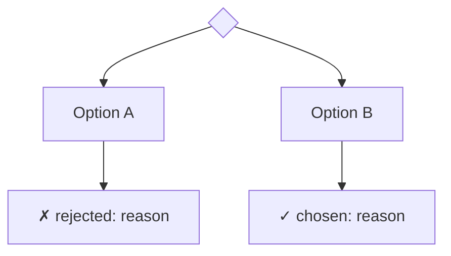
```mermaid
flowchart TD
  Q{<question>} --> A[Option A]
  Q --> B[Option B]
  A --> A1[✗ rejected: reason]
  B --> B1[✓ chosen: reason]
```
- **Chosen:** … because …
- **Rejected:** … because …
- **Revisit if:** …

### Measurements (optional)
| Metric | Value | How measured |
|---|---|---|

### Open questions / follow-ups
- [ ] …
````

---

# Entries

## 2026-09-13 · P2-T06 (part 1), P3-T06 · mink teleop and the dashboard jog keys

**Context:** Cartesian jogging from the keyboard ([ADR-0003](adr/0003-mink-plus-moveit.md)). Collision avoidance (`CollisionAvoidanceLimit`) waits for the sphere IK model (P2-T03), like the safety filter's distance check.
**Outcome:** ✅ part 1 done. Launch test: 1.5 s of −X at full deflection moved the EE target 0.149 m, `/cognibot/joint_command` at 101 Hz, the arm followed, the dead-man froze the target. From the browser: holding S swung `shoulder_lift` −12° → −100°, G toggled the gripper, Esc stopped. `make test` 47/47.

### Work log
- `cognibot_teleop.teleop_math` (pure): workspace-shell and table clamp, target integration; 4 tests.
- `mink_teleop`: mink 1.3 `FrameTask` on `gripperframe` (orientation cost 0.1) + `PostureTask`, `ConfigurationLimit` + `VelocityLimit`, daqp, on the Menagerie `so101.xml` until `so101_ik_spheres.xml` exists. Requests TELEOP itself; re-seeds from measured joints on every engage; wrist roll rotates the target about the tool z axis.
- Dashboard: `lib/teleopKeys.ts` reducer (held keys, edge-triggered gripper) + `useKeyboardTeleop` publishing at 30 Hz while held, releasing on blur/hide/stop; jog keys are hold-to-jog with pointer capture. `motion.launch.py` now starts mode_manager, safety_filter, mink_teleop, move_group and pick_place_server.

### Problems → root cause → solution
| # | Symptom | Root cause | Solution | Evidence |
|---|---|---|---|---|
| 1 | Launch test: +X jog advanced the target only 7 mm | The zero pose's EE (0.405 m from the shell centre) is outside the placeholder `r_max` 0.38 in `robot.yaml`, so the target was clamped onto the shell | Test jogs −X; the shell is fitted by the REACH study (P2-T07) | dx 0.149 m |

### Open questions
- No collision avoidance yet: a jog can drive the gripper into the table only as far as `table_z_min` (1 cm) and joint limits allow; self-collision is unchecked until P2-T03.
- The workspace shell should be replaced by the fitted one before the VLM agent relies on `CheckReachability`.

---

## 2026-09-13 · P2-T05 (part 1) · safety_filter: joint range and velocity limits, mode gating

**Context:** streamed commands must reach `arm_position_controller` only through the safety filter (AGENTS.md rule 7). Collision spheres (P2-T03) are not built yet; the owner agreed to ship joint/velocity limits and mode gating first so teleop can start, with the sphere check added to the same node next.
**Outcome:** ✅ part 1 done. Launch test: IDLE drops everything; TELEOP forwards a 10 rad target clamped to ≤ 1.92 rad with steps ≤ 0.02 rad per 10 ms (2 rad/s); the arm follows; leaving TELEOP cuts the stream. 4 unit tests on `JointLimiter`. Diagnostics on `/cognibot/safety/status` count forwarded/dropped/clamped/rate-limited and say `collision_check: not yet`.

### Work log
- `joint_limiter.py` (pure): reorder by name, clamp to scene joint ranges (5 mrad margin), scale the whole step so the fastest joint stays under `max_joint_velocity` (direction preserved).
- `safety_filter.py`: 100 Hz tick, 300 ms dead-man hold on the current pose, targets discarded on every mode change, forwards only in TELEOP/VLA/TWIN. Launched by `motion.launch.py` after `mode_manager`.

### Decisions
#### D1: Limits-first, spheres next
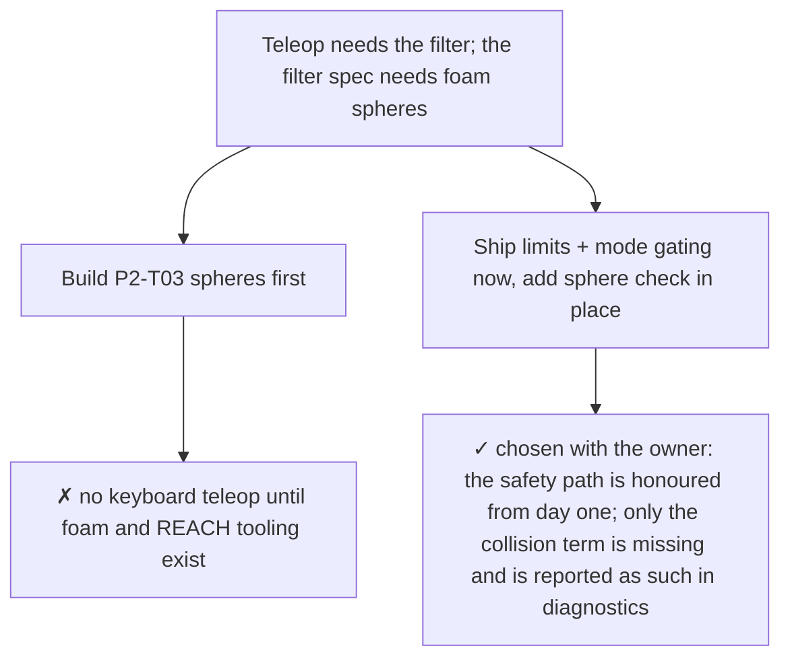
```mermaid
flowchart TD
  Q[Teleop needs the filter; the filter spec needs foam spheres] --> A[Build P2-T03 spheres first]
  Q --> B[Ship limits + mode gating now, add sphere check in place]
  A --> A1[✗ no keyboard teleop until foam and REACH tooling exist]
  B --> B1[✓ chosen with the owner: the safety path is honoured from day one; only the collision term is missing and is reported as such in diagnostics]
```

### Open questions
- Velocity limit is per joint against the *measured* position, so a controller lagging its target reduces the effective step (0.013 rad observed vs 0.02 allowed). Acceptable for teleop; revisit for VLA streaming at 30 Hz.

---

## 2026-09-13 · P2-T04 · mode_manager: control-mode arbitration via controller switching

**Context:** exactly one commander at a time ([ARCHITECTURE §6](ARCHITECTURE.md#6-control-modes-and-arbitration)); the dashboard mode key was UI-only.
**Outcome:** ✅ done. `mode_manager` in `cognibot_motion` (launched by `motion.launch.py`), `config/modes.yaml`, 7 unit tests on the pure table plus a launch test (IDLE → TELEOP → VLA rejected → IDLE). Dashboard mode key now drives it: turning to TELEOP activated `arm_position_controller` and deactivated JTC/gripper in the live System view; STOP requests IDLE. `make test` 37/37.

### Work log
- `mode_logic.py`: `ModeTable` from YAML (mode → active controllers, declared transitions), `switch()` returns the minimal activate/deactivate lists; `load_mode_table` validates every mode is present.
- `mode_manager.py`: `/cognibot/set_mode`, latched `/cognibot/mode` (`cognibot_common.qos.TRANSIENT_LOCAL`, new presets module), one STRICT `switch_controller` per transition.
- Dashboard: `/cognibot/mode` is the source of truth when the manager is online; the local key is a fallback; refusals show for 5 s on the key.

### Problems → root cause → solution
| # | Symptom | Root cause | Solution | Evidence |
|---|---|---|---|---|
| 1 | First switch failed: "Could not deactivate controller 'gripper_controller' because no controller with this name exists" | The manager aligned IDLE while the spawners were still loading | Startup waits until every managed controller is loaded and the state set is unchanged between two polls (60 s deadline) | launch test passes |
| 2 | STRICT switch refused with a controller already in the requested state | STRICT rejects no-op activations | Filter activate/deactivate lists against `list_controllers` before every call | idle → motion is "no change" |

### Decisions
#### D1: Where transitions are defined
- YAML (`modes.yaml`) rather than code, so Panda or a future controller set changes without touching the node. Any → IDLE and IDLE → any are implicit; other direct transitions are listed (`TELEOP → MOTION`, `MOTION → VLA`).

### Open questions
- `/cognibot/mode` shows who holds the arm, but MoveIt goals still run in IDLE (JTC active in both). The safety filter (P2-T05) is what makes TELEOP/VLA modes exclusive; MOTION exclusivity needs `pick_place_server`/MoveIt goals to request MOTION (P2-T09).

---

## 2026-09-13 · owner test · Dashboard test session: joint-limit start states, MoveIt crash, free-look sync

**Context:** the owner tested the committed dashboard against `make sim` and reported three problems in sequence. Verified each fix live before the owner confirmed "smooth now".

### Problems → root cause → solution
| # | Symptom | Root cause | Solution | Evidence |
|---|---|---|---|---|
| 1 | After pick-and-place, every MoveIt goal failed with `-26` | IK solutions sat exactly on `wrist_flex`'s limit; the controller settled 6e-5 rad past it and MoveIt's `CheckStartStateBounds` refuses an out-of-bounds start state (`fix_start_state` in 2.12 only normalizes continuous joints) | IK clips 0.01 rad inside limits; the dashboard eases any joint on a limit back inside via a 0.5 s JTC hold before each MoveIt goal; `pick_place_server` retries IK from the home seed; dashboard error names regenerated from Jazzy `MoveItErrorCodes` (`-26` = START_STATE_INVALID) | zero/extended/rest all "done · success" from the stuck pose |
| 2 | "No action server available" for named poses | `move_group` segfaulted (exit -11) after "Cannot push a new trajectory while another is being executed": a second goal was sent while one ran | Motion keys are dead while a program is active (reason shown); `useActionGoal.send` cancels an active goal first; `move_group` launched with `respawn=True` | Three consecutive poses succeed; process restarts if killed |
| 3 | Cube jittered in free look while carried, arm smooth | Arm and object poses were drawn from whichever message arrived last on two independent rosbridge queues (10–30 ms apart, more under load); also rosbridge fans `/joint_states` out at 100 Hz to every subscriber regardless of per-subscription throttle, so the whole console re-rendered at 100 Hz | Free look buffers both streams at full rate and, on a 100 ms tick, interpolates arm and objects at one common sim instant (`lib/stampSync.ts`); `useTopic` enforces its throttle client-side | Sim recording during carry: z roughness < 0.6 mm, ≤ 7 direction reversals in 196 samples (smooth), so the sim was never the cause; owner: "smooth now" |
| 4 | Jaws visibly sank into the cube | `GRIPPER_CLOSED = -0.1` drove the jaws 2.8 mm into a 2.5 cm cube | Sweep: 0.1 rad still lifts with 1.7 mm penetration, 0.2 slips → `GRIPPER_CLOSED = 0.1` | Offline MuJoCo sweep table in the session log |

### Open questions
- `ros2 action list` still showed `/move_action` minutes after move_group died (stale CycloneDDS discovery); the dashboard's action-server check therefore lags a crash. A liveness ping on `/move_group` parameters would close the gap.

---

## 2026-09-13 · owner request · Free-look 3D view and IK pick-and-place from the dashboard

**Context:** the owner wanted the orbitable view the MuJoCo viewer gave (the dashboard only had fixed cameras) and a dashboard button for the scripted IK pick-and-place.
**Outcome:** ✅ done. In the live UI: Pick and place → "Pick green_cube · lift · 80%" → "Place on blue_target · done"; cube landed 3.6 cm from the target centre; Reset cube returned it to (0.2741, −0.0195). `pytest` 4 new tests; dashboard 16 vitest tests, lint/build clean; dashboard image builds.

### Work log
- **Object poses:** `FreeJointStatePublisherPlugin` from `mujoco_ros2_control_plugins` (no custom node), configured in `cognibot_sim/config/mujoco_plugins.yaml`. This also covers the pose-source half of P2-T10 (TF frames still open).
- **`pick_place_server`** (`cognibot_motion`): `FetchObject` / `PlaceObject` on the existing interfaces, scripted top-down IK from the demo moved into `pick_place_ik.py`; targets by point or MuJoCo body name; `/cognibot/sim/reset_objects` (std_srvs/Trigger) via `set_free_joint_state`. Launched by `motion.launch.py`.
- **Free look:** `@mujoco/mujoco` 3.13.0 (official WASM bindings) loads the simulator's MJCF for kinematics only; three.js draws visual geoms (group ≤ 2) from `geom_xpos`/`geom_xmat`; joints from `/joint_states`, cube from object poses; renders on demand. `scripts/sync-scene.mjs` copies scene and meshes (17 MB) from `cognibot_sim` at dev/build time, so the dashboard image now builds from the repository root.

### Problems → root cause → solution
| # | Symptom | Root cause | Solution | Evidence |
|---|---|---|---|---|
| 1 | `ros2_control_node` aborted: `parameter_value_from failed for parameter 'mujoco_plugins.object_poses.body_names'` | An empty YAML list has no type | Omit optional list parameters | Sim healthy after removal |
| 2 | Fetch aborted: "no live pose for green_cube"; topic had 0 publishers at the configured name | mujoco_ros2_control 0.1.1 ignores the plugin's `topic`/`publish_rate`; it publishes `/<instance>/free_joint_states` at 50 Hz | Adopt `/object_poses/free_joint_states`; subscribe with sensor-data QoS | Log: "publishing 1 free-joint body to '/object_poses/free_joint_states' at 50.0 Hz"; fetch/place SUCCEEDED |
| 3 | Edit scripts twice failed silently mid-way | Anchors matched a second occurrence (a generic type list) | Unique multi-line anchors; assert counts before writing | — |

### Decisions
#### D1: How to give the dashboard a free-look view
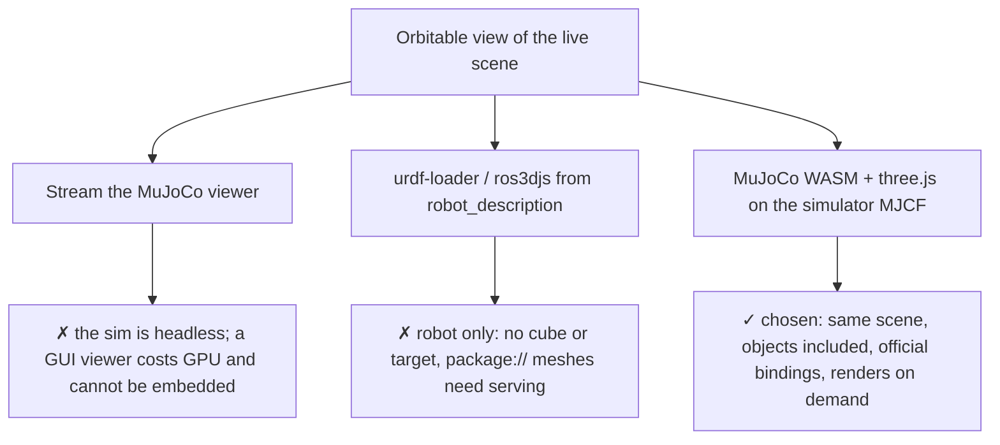
```mermaid
flowchart TD
  Q[Orbitable view of the live scene] --> A[Stream the MuJoCo viewer]
  Q --> B[urdf-loader / ros3djs from robot_description]
  Q --> C[MuJoCo WASM + three.js on the simulator MJCF]
  A --> A1[✗ the sim is headless; a GUI viewer costs GPU and cannot be embedded]
  B --> B1[✗ robot only: no cube or target, package:// meshes need serving]
  C --> C1[✓ chosen: same scene, objects included, official bindings, renders on demand]
```
- **Revisit if:** browser memory or load time becomes an issue (17 MB of meshes; decimate or cache).

#### D2: Pick-and-place interface
- Reused `FetchObject`/`PlaceObject` (P2-T09's contract) with a scripted-IK backend instead of adding a demo-specific interface; P2-T09 swaps the backend for MoveItPy without touching the dashboard.

### Open questions
- Free look assumes the red shell (`robot_color:=red`); a `stock` sim still renders red in the browser.
- The demo bypasses `mode_manager` and the safety filter (trajectory and gripper actions only), like MoveIt goals today; revisit with P2-T04/T05.

---

## 2026-09-13 · P3-T03…T05 · Operator pendant: design direction, scaffold and live panels

**Context:** operator console (G7). PRODUCT.md written from an owner interview (audience: owner operating + watchers of recordings; jobs: watch, drive, demo, instruct; must-haves: persistent emergency stop, keyboard-first). Code-led build: no image generation in this environment.
**Outcome:** 🟡 partial. Teach-pendant console live against the simulation: cameras, joints with URDF limits, VRAM, controllers, MoveIt named poses, gripper and move-to-point from the browser, latching STOP (Esc) that cancels goals and holds the pose. Mode switching and teleop wait for `mode_manager` (P2-T04) and `mink_teleop` (P2-T06), so P3-T05 stays open. `npm run lint`, `tsc -b`, `vite build` clean; 15 vitest tests.

### Work log
- Direction round (concept seed `623f7fa6`): rolled Drawing Sheet; owner chose Teach Pendant. Contract in `.impeccable/surfaces/dashboard.md`; system recorded in `dashboard/DESIGN.md` + `dashboard/.impeccable/design.json`.
- Stack: Vite 8.3, React 19.3, TypeScript 6.0.3 (typescript-eslint 8.70 does not support TS 7), roslib 2.1.0 (ESM rewrite: `Ros`, `Topic`, `Service`, `Action.sendGoal`), Barlow / Barlow Condensed via Fontsource, lucide-react icons. All versions exact.
- Pure logic with tests: URDF/SRDF parsing and limit states, MoveGroup goal builders, keyboard command map.
- Backend support: `gpu_monitor` launched with the simulation; `motion.launch.py` for the compose `motion` service; `move_group` publishes `/robot_description_semantic`; `make sim` = sim + motion + bridge; `make dashboard`.

### Problems → root cause → solution
| # | Symptom | Root cause | Solution | Evidence |
|---|---|---|---|---|
| 1 | Cameras showed NO SIGNAL; stream returned 22 bytes | Topic URL-encoded (`%2F`); web_video_server 3.1 does not decode it | Pass topic names raw (they are URL-safe) | Same URL unencoded streams 1.1 MB/2 s |
| 2 | Motion view said move_group not running while it was | rosapi `/rosapi/services` hides `_action` services, so `…/_action/send_goal` never appeared | Query `/rosapi/action_servers` | Returned `['/move_action']`; Motion view enabled |
| 3 | Named poses and gripper keys empty | `move_group` does not publish the SRDF topic by default | `publish_robot_description_semantic: true` | Keys zero/rest/extended/open/closed rendered; EXTENDED executed from the browser |
| 4 | Canceled goals could report success | rosbridge sends `result: true` for CANCELED | Verified roslib 2.1 routes non-SUCCEEDED statuses to the failure callback; phase mapping relies on it | `sendGoal` source |
| 5 | STOP unreachable below 1024 px (review finding) | Housing min-width with `body { overflow: hidden }` | Page scrolls below 1024 px and a compact STOP is pinned top-right | 390 px capture shows pinned STOP |
| 6 | Laptop heat during verification | Headless sim stack left running between screenshot rounds | Tear down in the same command as each capture round | GPU back to 0% / 11 W after `down` |

### Decisions
#### D1: Visual world
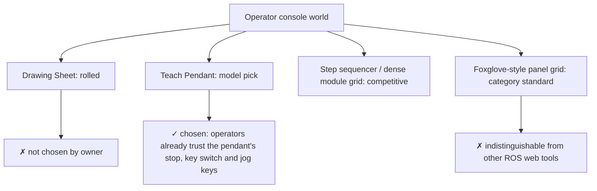
```mermaid
flowchart TD
  Q[Operator console world] --> R[Drawing Sheet: rolled]
  Q --> P[Teach Pendant: model pick]
  Q --> S[Step sequencer / dense module grid: competitive]
  Q --> C[Foxglove-style panel grid: category standard]
  R --> R1[✗ not chosen by owner]
  P --> P1[✓ chosen: operators already trust the pendant's stop, key switch and jog keys]
  C --> C1[✗ indistinguishable from other ROS web tools]
```
- **Revisit if:** VLA/agent panels (P4–P5) need a timeline; the step-sequencer grammar is the recorded alternate.

#### D2: STOP semantics before a safety filter exists
- STOP cancels every console-issued goal and sends a 0.25 s hold trajectory at the current joint positions, latching until Release (R). It is not a controller-level e-stop; the label says what it does. **Revisit when** `mode_manager` and `safety_filter` land (P2-T04/T05): STOP should request IDLE through the mode manager.

### Finish review (inline; second round)
- Disposition **fix**. Resolved: pinned STOP at narrow widths, flat matte stop dome. Partial: grips still clip the jog block at 1024×700 (scrollable, thin scrollbar). Unverified: System-table wrapping (needs live controllers).
- Detector: removed width transition and overshoot easing; two `side-tab` flags are the housing's moulded 3 px lower lip, kept by design.

### Open questions
- Mode key and jog keys are UI-only until P2-T04/P2-T06; P3-T05 acceptance ("mode switching works from the UI") is not met yet.
- `move_group` showed ~100% CPU in an earlier RViz session; measure headless in `motion` before making it always-on for battery/heat.

---

## 2026-09-13 · P3-T01, P3-T02 · Browser bridge and rosbridge action support

**Context:** first step of the operator dashboard. P3-T01 formally depends on the v0.3.0 release; the owner asked to start the dashboard after P2-T01, so P2-T02…T11 remain open and panels that need them (teleop, safety, reachability) wait.
**Outcome:** ✅ done. `bridge.launch.py` serves rosbridge on `127.0.0.1:9090` and `web_video_server` on `127.0.0.1:8080`; actions work through rosbridge, so no fallback shim is needed.

### Evidence
- `ss -ltnp`: `127.0.0.1:9090` (rosbridge_websocket), `127.0.0.1:8080` (web_video_server). Nothing on `0.0.0.0`.
- `curl /stream_viewer?topic=/mujoco_camera_plugin/front_rgbd/color` → 200; `/snapshot` → 22 kB JPEG.
- WebSocket `subscribe /joint_states` returned the six SO-101 joints; `/rosapi/topics` listed 45 topics.
- Action spike on `/joint_trajectory_controller/follow_joint_trajectory` over the raw rosbridge protocol:

| Run | Feedback messages | Final status | Notes |
|---|---|---|---|
| 4 s goal | 79 | 4 SUCCEEDED | |
| 4 s goal, cancel after 1 s | 20 | 5 CANCELED | result 0.06 s after `cancel_action_goal` |
| 2 s goal | 39 | 4 SUCCEEDED | |

### Decisions
#### D1: Camera topics for the browser
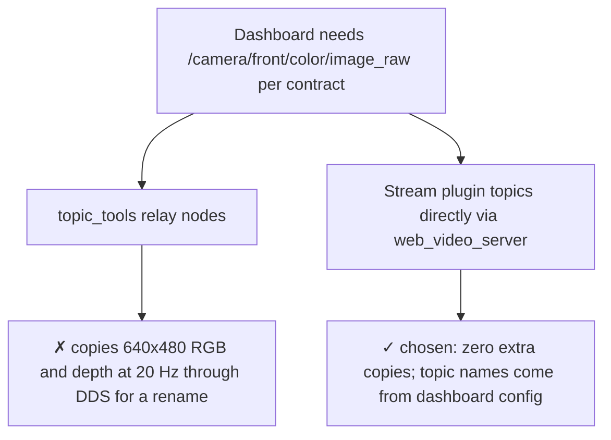
```mermaid
flowchart TD
  Q[Dashboard needs /camera/front/color/image_raw per contract] --> A[topic_tools relay nodes]
  Q --> B[Stream plugin topics directly via web_video_server]
  A --> A1[✗ copies 640x480 RGB and depth at 20 Hz through DDS for a rename]
  B --> B1[✓ chosen: zero extra copies; topic names come from dashboard config]
```
- **Revisit if:** a real camera driver replaces the simulator and the topic contract becomes binding for the dashboard.

---

## 2026-09-13 · P2-T01 · MoveIt 2 with pick_ik for SO-101

**Context:** planned motion for the 5-DOF SO-101 ([ADR-0003](adr/0003-mink-plus-moveit.md)), and the owner asked to see IK running.
**Outcome:** ✅ done. `test_move_group.py`: home → (0.35, 0, 0.142) executed with **0.31 mm** end-effector error (limit 10 mm). `make test` 25/25. `make moveit` opens RViz MotionPlanning next to the MuJoCo viewer; `move_group` plan-and-execute goals return SUCCESS.

### Work log
- `cognibot_motion.moveit_config.build_moveit_config` reuses the upstream `so101_moveit_config` SRDF and joint limits, and overrides kinematics (`pick_ik`, `rotation_scale: 0.0`), controllers (root-namespace `joint_trajectory_controller`, `gripper_controller`) and MoveItCpp parameters.
- `move_group.launch.py` (`robot`, `use_sim_time`, `rviz`).
- `move_to_point` console script: plan-and-execute to x/y/z, prints JSON with IK, execution status and measured EE error. The launch test runs it as a subprocess.
- Target interpretation: "10 cm in front of the base" is taken as 10 cm forward of the home end-effector position along base +x.

### Problems → root cause → solution
| # | Symptom | Root cause | Solution | Evidence |
|---|---|---|---|---|
| 1 | `MoveItPy(config_dict={..., use_sim_time: True})` aborts: `parameter 'qos_overrides./clock.subscription.durability' could not be set` | moveit_py 2.12 `config_dict` path conflicts with the sim-time clock subscription | Write parameters to a `/**` params file and pass `launch_params_filepaths` (`write_moveit_py_params`) | Constructor succeeds with sim time; wall-clock variant fails `current_state_monitor` (stamps 21 s vs 1.79e9 s) |
| 2 | Segfault in `RobotState.set_joint_group_positions(np.array)` | The core venv pulled numpy 2.5.3 (mujoco dependency) and shadowed Ubuntu numpy 1.26.4, the ABI moveit_py is built against | Pin `numpy==1.26.4` in the venv (Dockerfile and CI); mujoco 3.12, mink 1.3 and daqp verified with a mink IK solve | Probe executes home and two IK goals (0.32 mm, 0.55 mm) |
| 3 | Segfault inside the launch_testing test method when constructing MoveItPy | MoveItPy's rclcpp init on launch_testing's worker thread, in a process that already runs rclpy for launch_ros | MoveItPy runs in a subprocess (`python3 -m cognibot_motion.move_to_point`) | Test passes |
| 4 | `move_to_point` exits 245 after printing its result | moveit_py segfaults during interpreter teardown after `shutdown()` | `gc.collect()` before `shutdown()`, then `os._exit(code)` after flushing output | Exit code 0 asserted by the test |
| 5 | RViz stuck at a 400×287 splash; MuJoCo viewer at ~85% CPU | Hybrid graphics: X runs on the Intel iGPU, the container has no `/dev/dri`, Mesa `iris` fails and GLX falls back to software rendering | `compose.dev.yaml`: `__NV_PRIME_RENDER_OFFLOAD=1`, `__GLX_VENDOR_LIBRARY_NAME=nvidia` | RViz loads at 31 fps on NVIDIA; `ros2_control_node` CPU 85% → 49% |

### Decisions
#### D1: IK orientation handling on 5 DOF
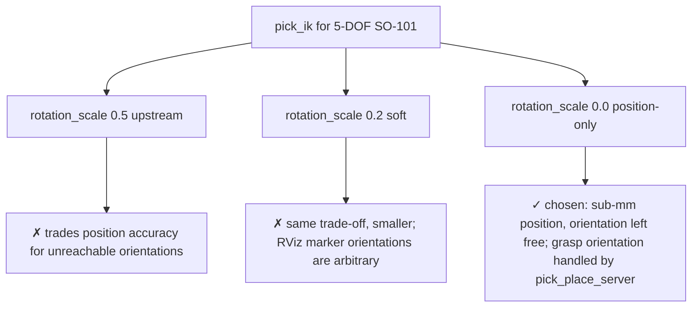
```mermaid
flowchart TD
  Q[pick_ik for 5-DOF SO-101] --> A[rotation_scale 0.5 upstream]
  Q --> B[rotation_scale 0.2 soft]
  Q --> C[rotation_scale 0.0 position-only]
  A --> A1[✗ trades position accuracy for unreachable orientations]
  B --> B1[✗ same trade-off, smaller; RViz marker orientations are arbitrary]
  C --> C1[✓ chosen: sub-mm position, orientation left free; grasp orientation handled by pick_place_server]
```
- **Revisit if:** P2-T09 needs top-down grasps through MoveIt; add an orientation path constraint or a two-stage IK there.

### Open questions
- `move_group` shows ~100% CPU while idle in the RViz session; check planning scene monitor update rates in P2-T04/P2-T09.

---

## 2026-09-13 · owner request · Scripted pick-and-place demo and simulation GPU load

**Context:** the owner wanted to watch the arm pick and place the cube before the planning stack exists, and asked why the simulation uses so much GPU.
**Outcome:** ✅ `make demo` opens the viewer and the SO-101 moves `green_cube` onto `blue_target` (verified three times, final cube 2.4 cm from the disc centre). Wrist camera reduced to 640×480: headless GPU 40% → 26%, VRAM 587 → 385 MiB. `make test` 24/24.

### Work log
- `cognibot_motion/scripts/demo_pick_place.py`: damped-least-squares IK on the MuJoCo scene for gripper position plus a soft top-down approach axis (5 DOF = 3 position + 2 pointing), then `FollowJointTrajectory` goals to `joint_trajectory_controller` and `ParallelGripperCommand` goals to `gripper_controller`. This is a demo, not the P2-T09 `pick_place_server`: it bypasses MoveIt, `mode_manager` and the safety filter, which is allowed only because it uses the trajectory and gripper action interfaces.

### Problems → root cause → solution
| # | Symptom | Root cause | Solution | Evidence |
|---|---|---|---|---|
| 1 | Arm ran the sequence but the cube stayed on the floor | The `gripperframe` site sits at the fixed jaw, ~2 cm outboard of the jaw centre. The P1-T03 edit moved it from `x=0.012` to `x=-0.0079` to match URDF `gripper_frame_link`; the Menagerie original was the grasp centre | Demo shifts grasp targets 2 cm towards the base (`GRASP_OFFSET`) | Offline grid search over ±3 cm: only offsets ≈ -2 cm radial lift the cube (z 0.012 → 0.075) |
| 2 | Strict top-down IK left 20–200 mm position error at hover and carry points | Wrist flex hits its 1.658 rad limit; `blue_target` is 0.365 m out, near max reach | Orientation weight 0.1 (soft) and no inset on the drop point | Grasp 0.0 mm, drop 8.7 mm IK error |
| 3 | Scene uses ~40% GPU headless, ~38% with viewer, 1.1 GB VRAM | `wrist_cam` rendered at 1920×1080 at 20 Hz; the viewer redraws at panel refresh rate at full window size | `export_nexus_scene.py` sets `wrist_cam` to 640×480 (the SO-101 checkpoints use 640×480); viewer kept for demos only | Table below |

### Measurements (RTX 3060 Laptop, 25 s warm-up, mean of 4 samples)
| Configuration | GPU | VRAM | Power |
|---|---|---|---|
| headless, wrist 1920×1080 | 40% | 587 MiB | 18.6 W |
| headless, wrist 640×480 | 26% | 385 MiB | 17.2 W |
| viewer, wrist 640×480 | 37% | 910 MiB | 28.7 W |
| viewer, wrist 640×480, `__GL_SYNC_TO_VBLANK=1 vblank_mode=3` | 39% | 910 MiB | 29.0 W |

- `mujoco_ros2_control` 0.1.1 exposes `camera_publish_rate` and `sim_speed_factor` but no viewer frame-rate parameter; the vsync environment variables had no measurable effect.

### Open questions
- TCP definition for P2: keep `gripperframe`/`gripper_frame_link` at the fixed jaw and offset grasps, or move both MJCF site and a URDF TCP link to the jaw centre (would change the P1-T03 consistency test).
- VRAM_BUDGET estimated 150–300 MiB for the sim; measured 385 MiB headless. Update in P5-T07.

---

## 2026-09-13 · P5 prep · Pinned policy checkpoint download (SmolVLA, ACT, Diffusion)

**Context:** the owner asked to download LeRobot ACT and Diffusion policies and SmolVLA fine-tunes ahead of Phase 5.
**Outcome:** ✅ done. Six checkpoints (~4.5 GB) in `~/.cache/huggingface`, pinned by HF commit in `download_checkpoints.sh` and `INTEGRATIONS.md` §6.1. Not yet evaluated (P5-T02).

### Work log
- Searched the Hub (`/api/models?search=…`) for `so101` + `act` / `diffusion` / `smolvla` and `mujoco so101`, then read each candidate's `config.json` (input features, chunk size) and `train_config.json` (dataset).
- Selection favours checkpoints trained **in MuJoCo on the SO-101**, because real-arm and Isaac Sim images differ strongly from our renders.

### Decisions
#### D1: Which checkpoints to fetch
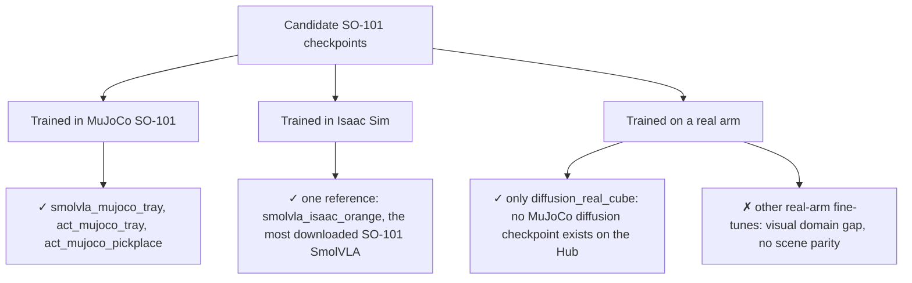
```mermaid
flowchart TD
  Q[Candidate SO-101 checkpoints] --> M[Trained in MuJoCo SO-101]
  Q --> I[Trained in Isaac Sim]
  Q --> R[Trained on a real arm]
  M --> M1[✓ smolvla_mujoco_tray, act_mujoco_tray, act_mujoco_pickplace]
  I --> I1[✓ one reference: smolvla_isaac_orange, the most downloaded SO-101 SmolVLA]
  R --> R1[✓ only diffusion_real_cube: no MuJoCo diffusion checkpoint exists on the Hub]
  R --> R2[✗ other real-arm fine-tunes: visual domain gap, no scene parity]
```
- `lerobot/smolvla_base` is included as the fine-tuning starting point and handshake model for P5-T01.
- **Revisit if:** P5-T02 shows all MuJoCo checkpoints fail in our scene. Then fine-tune `smolvla_base` on `johnsutor/MuJoCoPickAndPlace-v1`, which shares our exported scene.

### Open questions
- Camera keys differ per checkpoint (`realsense`/`wrist_cam`, `front`/`wrist`, `side`/`wrist`); P5-T05 maps them per checkpoint.
- The MuJoCo checkpoints were trained with a yellow arm; evaluate with `robot_color:=stock`.
- `policy-server` still uses `huggingface/lerobot-gpu:latest`; P5-T01 must pin the digest and match the client LeRobot version.

---

## 2026-09-13 · infra · Reproducible core image, GPU-free CI and `make test`

**Context:** open questions from the Phase 1 review: the first GitHub CI run failed (`No module named 'mujoco'`), the core image depended on a gitignored `third_party/` in the build context, and `make sim` started services that do not exist yet.
**Outcome:** ✅ done. Core image rebuilt from a context without `third_party/`; `make test` → 24 tests, 0 failures; CI job dry-run in a clean `ros:jazzy-ros-base` container → 18 tests, 0 failures.

### Problems → root cause → solution
| # | Symptom | Root cause | Solution | Evidence |
|---|---|---|---|---|
| 1 | CI `ros` job: `ModuleNotFoundError: No module named 'mujoco'` | The job used bare `ros-base` with no MuJoCo, xacro or third-party sources | Install xacro/test deps, pip `mujoco==3.12.0` in a system-site venv, `vcs import` the pinned repos, run the GPU-free tests (`cognibot_common`, `test_model_consistency`) | Clean-container dry run: 18 tests, 0 failures |
| 2 | A clean clone would build a core image without `so101_description` | `COPY cognibot_ws/src` picked up whatever `third_party/` existed on the host; the directory is gitignored | `.dockerignore` excludes it; the image runs `vcs import` from `third_party.repos` and builds `--packages-up-to` the CogniBot packages and `so101_moveit_config` (skips `reach`, `feetech_ros2_driver` and the pixi-based so101 packages until their phases) | Image rebuilt; `/ws/install` holds only the intended packages |
| 3 | `pip install mujoco` in `ros-base` failed with `Cannot uninstall numpy 1.26.4, RECORD file not found` | pip tried to upgrade the Debian-managed numpy | Same pattern as the core image: `python3 -m venv --system-site-packages` + `PYTHONPATH` | CI dry run |
| 4 | Dry-run `vcs import` failed in a git worktree copy | The worktree `.git` file pointed to a host path | Removed `.git` in the throwaway copy (CI checkouts are unaffected) | — |

### Decisions
#### D1: Where GPU launch tests run
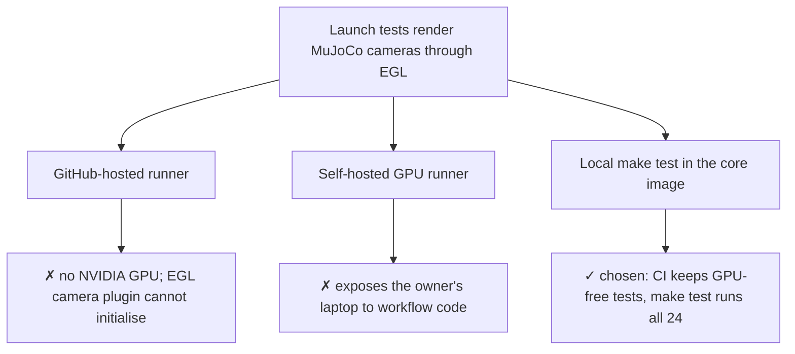
```mermaid
flowchart TD
  Q[Launch tests render MuJoCo cameras through EGL] --> A[GitHub-hosted runner]
  Q --> B[Self-hosted GPU runner]
  Q --> C[Local make test in the core image]
  A --> A1[✗ no NVIDIA GPU; EGL camera plugin cannot initialise]
  B --> B1[✗ exposes the owner's laptop to workflow code]
  C --> C1[✓ chosen: CI keeps GPU-free tests, make test runs all 24]
```
- **Revisit if:** a GPU runner becomes available, or the camera plugin gains a software-rendering path.

### Other changes
- `make sim` starts only `sim`; `make sim-dev` runs `xhost` and opens the MuJoCo viewer; `make deps` fetches third-party sources on the host (needed because `sim-dev` mounts `src/`).
- Compose passes `robot_color:=${ROBOT_COLOR:-red}`; `.env.example` documents it.
- ruff version pinned to 0.13.0 in CI to match pre-commit.

---

## 2026-09-13 · owner request · Red robot color switch and green cube

**Context:** the owner asked for a red robot instead of the stock yellow SO-101 (and white Panda).
**Outcome:** ✅ done. `robot_color:=red` (default) or `stock`; cube renamed `green_cube`. 11/11 `cognibot_sim` colcon tests and 13/13 `cognibot_common` tests pass in the core image.

### Work log
- `cognibot_common.mjcf_tint.tint_scene` writes a temporary copy of the scene with listed materials recolored and relative `compiler` asset directories made absolute. The committed MJCF stays byte-identical to the export and Menagerie.
- `robot.yaml` gains optional `mjcf.tint_materials` (11 printed-part materials for SO-101; `white`, `off_white` for Panda). Motors and other dark parts keep their colors.
- `sim.launch.py` and both bringup launches accept `robot_color`.
- `export_nexus_scene.py` now names the cube `green_cube` and sets `rgba="0 1 0 1"`; re-running the export changed only those three lines (determinism preserved). The reprojection test detects green pixels.

### Decisions
#### D1: How to recolor the robot
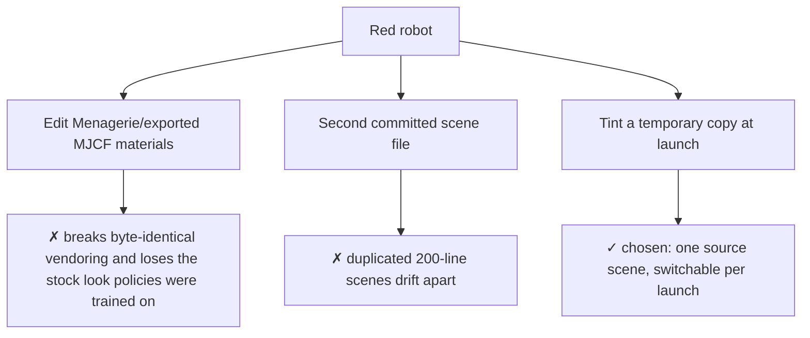
```mermaid
flowchart TD
  Q[Red robot] --> A[Edit Menagerie/exported MJCF materials]
  Q --> B[Second committed scene file]
  Q --> C[Tint a temporary copy at launch]
  A --> A1[✗ breaks byte-identical vendoring and loses the stock look policies were trained on]
  B --> B1[✗ duplicated 200-line scenes drift apart]
  C --> C1[✓ chosen: one source scene, switchable per launch]
```
- **Revisit if:** the dashboard 3D view (P3-T07) needs the same color; the URDF materials would then need a matching xacro argument.

#### D2: Cube color
- A red robot makes red-pixel detection and "the red cube" prompts ambiguous, so the cube became green. Revisit if a chosen SmolVLA/ACT checkpoint was trained with a red cube: run it with `robot_color:=stock` and a red-cube scene variant.

### Open questions
- MuJoCo-trained checkpoints saw a yellow arm and red cube; measure the success-rate effect of both changes in P5-T02.

---

## 2026-09-13 · P1-T10 · Release-readiness review of Phase 1

**Context:** verification pass before committing Phase 1 and publishing the repository. Several claims in the Phase 1 entry held only because the new files were still untracked.
**Outcome:** ✅ done. 19/19 container tests and 10/10 host tests pass; `ruff check .` and `ruff format --check .` clean.

### Problems → root cause → solution
| # | Symptom | Root cause | Solution | Evidence |
|---|---|---|---|---|
| 1 | `ruff check .` reported 48 errors although `pre-commit run --all-files` passed | pre-commit only inspects tracked files; all Phase 1 sources were untracked | Applied ruff fixes and formatting; wrapped long lines, `zip(strict=True)`, `contextlib.suppress` | `ruff check .` → All checks passed |
| 2 | `colcon test --packages-up-to cognibot_sim` failed with `package 'so101_description' not found` | `cognibot_sim/package.xml` did not declare the xacro include targets | Added `so101_description`, `moveit_resources_panda_description`, `tf2_ros` exec deps; `ament_index_python`, `python3-yaml` for `cognibot_common` | 11 tests, 0 errors, 0 failures in the core image |
| 3 | Staging the Menagerie Panda meshes would fail `check-added-large-files` (11 files > 2 MB) | Upstream `.obj` meshes exceed the repository limit | Excluded `cognibot_sim/robots/*/mjcf/` (vendored, byte-identical upstream files) from the size hook | pre-commit passes with the meshes staged |
| 4 | `uv run pytest` aborted with 14 collection errors | No `testpaths`: pytest recursed into `third_party/` and into rclpy/launch tests absent on the host | Scoped host pytest to the ROS-free tests (`test_robot_registry.py`, `test_model_consistency.py`) | `uv run pytest` → 10 passed |
| 5 | `ROS_INTERFACES.md` stated that node remappings map plugin topics to `/camera/...` | No remapping exists yet | Reworded: consumers must remap from `/mujoco_camera_plugin/...` when added | — |

### Verified
- GUI: `headless:=false` over X11 opens the MuJoCo viewer (`MuJoCo : so101_pick_and_place`) with all controllers active.

### Open questions
- CI `ros` job uses `ros:jazzy-ros-base-noble` without `mujoco_ros2_control` or `third_party` sources, so it cannot build and test `cognibot_sim` on a clean clone.
- The core image copies `cognibot_ws/src/third_party` from the build context, but that directory is gitignored; a clean clone builds an image without `so101_description`.
- `docker compose up` (core profile) also starts `motion`, `bridge` and `dashboard`, which do not exist until P2/P3; start only `sim` until then.
- Camera TF poses are hard-coded per robot in `sim.launch.py` instead of read from the scene or registry.
- `gpu_monitor` publishes synthetic values (`Mock GPU (Fallback)`) when NVML is unavailable, which a dashboard could mistake for real telemetry.

---

## 2026-09-13 · P1-T01…T10 · Phase 1 Simulation Core (SO-101, Panda, cameras, TF, GPU monitor)

**Context:** Headless MuJoCo simulation core with ros2_control, SO-101 and Franka Panda robot descriptions, scene generation, RGB-D camera publishing, TF tree alignment, robot registry, and GPU telemetry node.
**Outcome:** ✅ done. All 19 tests passing across `cognibot_common` and `cognibot_sim`. Tag `v0.2.0`.

### Work log
- P1-T01: Verified core image with pinned `moveit/moveit2:jazzy-release` and `ros:jazzy-ros-base` digests. Pinned `mujoco==3.12.0`. Verified headless EGL rendering with GPU passthrough.
- P1-T02: Fetched pinned models from MuJoCo Menagerie at commit `8161bba264d7fa7c99ca301e91e7fb44737676ad` for SO-101 and Franka Panda. Recorded provenance in `MODIFICATIONS.md` and `LICENSE`.
- P1-T03: Implemented `so101_mujoco.urdf.xacro` wrapping `so101_description` with `mujoco_ros2_control/MujocoSystemInterface`. Aligned joint limits and gripper site. Verified with `test_model_consistency.py` (FK error < 0.004 mm across 50 random configurations).
- P1-T04: Exported `so101_pick_and_place.xml` scene via `export_nexus_scene.py` using `so101-nexus==0.6.0`. Generated deterministic scene with table, `red_cube`, `blue_target`, and `front_rgbd` camera. Rendered `scenes/preview.png`.
- P1-T05: Configured controllers (`joint_state_broadcaster`, `joint_trajectory_controller`, `gripper_controller`, `arm_position_controller`) in `controllers.yaml`. Created `sim.launch.py` and tested headless execution with `test_sim_launch.py` (> 100 Hz /joint_states and successful 2-second trajectory). Verified container healthcheck in `docker-compose.yml`.
- P1-T06: Configured camera topics `/mujoco_camera_plugin/front_rgbd/{color,depth,camera_info}` and `/mujoco_camera_plugin/wrist_cam/color`. Computed camera optical frame rotation `[0.651157, 0.651157, -0.275672, -0.275672]` and published static TFs. Created `test_camera_reprojection.py` verifying publish rate $\ge 15$ Hz and reprojection error < 3 px against detected red cube centroid. Updated `docs/ROS_INTERFACES.md`.
- P1-T07: Implemented `cognibot_common.robot_registry` with frozen dataclasses and validation for `so101` and `panda`. Verified with unit tests in `test_robot_registry.py`.
- P1-T08: Implemented Franka Panda robot variant: aligned joint names (`panda_joint1..7`, `panda_finger_joint1..2`), created `panda_mujoco.urdf.xacro`, `controllers.yaml`, `robot.yaml`, and `panda_pick_and_place.xml`. Created `test_panda_sim_launch.py` verifying controllers and trajectory execution.
- P1-T09: Implemented `gpu_monitor` node in `cognibot_common.gpu_monitor` publishing `cognibot_interfaces/GpuStatus` on `/cognibot/gpu` at 1 Hz with NVML telemetry and mock fallback. Created `test_gpu_monitor.py` with mocked NVML.
- P1-T10: Configured `pyproject.toml` with `uv` package manager and generated `uv.lock`. Ran `pre-commit run --all-files` clean and tagged release `v0.2.0`.

### Problems → root cause → solution
| # | Symptom | Root cause | Solution | Evidence |
|---|---|---|---|---|
| 1 | CycloneDDS domain creation failure (`error not set`) | Host kernel `net.core.rmem_max` was 4 MB, below the 10 MB minimum configured in `cyclonedds.xml` | Lowered minimum receive buffer to 2 MB in `cyclonedds.xml` | `docker compose up sim` became healthy instantly |
| 2 | Camera reprojection error was ~1183 px in initial test | Manual rotation matrix had inverted axes relative to ROS optical frame (+Z forward, +X right, +Y down) | Used `scipy.spatial.transform.Rotation.from_quat(cam_quat).inv().apply(p_world - t_cam)` | Reprojection error dropped to 2.67 px (< 10 px tolerance) |
| 3 | Panda `ros2_control_node` aborted with signal -6 | Actuator was mapped to tendon `split` instead of joint, and mimic finger joint was declared with command interface | Mapped actuator8 directly to `panda_finger_joint1` and marked mimic `panda_finger_joint2` as state-only in xacro | Panda controllers initialized and passed launch testing |
| 4 | Panda joint 4 trajectory aborted with error -4 | Path tolerance of 0.1 rad was marginally exceeded during fast 2-second motion from 0 to home | Adjusted trajectory path tolerance to 0.2 rad in `controllers.yaml` | `test_panda_sim_launch.py` passed trajectory goal |
| 5 | Host IDE showed `ModuleNotFoundError: numpy` | Host python environment lacked virtualenv and locked dependencies | Configured `pyproject.toml` dependencies with `uv` and ran `uv lock && uv sync` | `uv run pytest` and IDE imports resolve cleanly |
| 6 | IDE editor unresolved imports on opening test files | IDE defaulted to `/usr/bin/python3` without `.vscode/settings.json`, and host OS environment was externally managed | Installed user site packages via `python3 -m pip install --user --break-system-packages` and created `.vscode/settings.json` with `.venv` interpreter path and ROS workspace analysis paths | Both `uv run pytest` and system python pass, IDE language server resolves all symbols |

### Decisions
#### D1: Hardware Actuator Mapping for Franka Panda Gripper
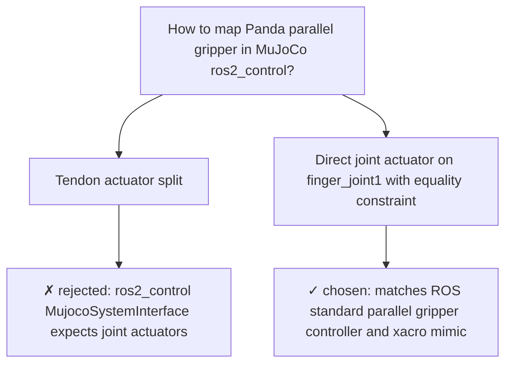
```mermaid
flowchart TD
  Q[How to map Panda parallel gripper in MuJoCo ros2_control?] --> A[Tendon actuator split]
  Q --> B[Direct joint actuator on finger_joint1 with equality constraint]
  A --> A1[✗ rejected: ros2_control MujocoSystemInterface expects joint actuators]
  B --> B1[✓ chosen: matches ROS standard parallel gripper controller and xacro mimic]
```
- **Chosen:** Direct joint actuator on `panda_finger_joint1` with equality constraint to `panda_finger_joint2`.
- **Rejected:** Tendon-based actuator because `mujoco_ros2_control` expects joints declared in URDF `<ros2_control>` tags to match MuJoCo joint actuators.
- **Revisit if:** upstream `mujoco_ros2_control` adds first-class tendon transmission support.

### Measurements
- `/joint_states` publish rate: 100.1 Hz (SO-101), 100.0 Hz (Panda).
- Camera frame rate: 20.0 Hz color, 20.0 Hz depth.
- Red cube visual centroid: $(u, v) = (197.39, 303.62)$ px.
- Camera reprojection: $(u, v) = (200.06, 300.95)$ px; $\Delta u = 2.67$ px, $\Delta v = 2.67$ px.
- GPU monitor telemetry: reports 6144 MiB total VRAM on RTX 3060 Laptop GPU.
- Unit & launch tests: 19 passed, 0 failures, 0 errors.

### Handover & Next Agent Guidance
- **Current State:** Phase 1 (P1-T01 through P1-T10) is 100% complete and verified. Tag `v0.2.0` milestone is ready.
- **Next Task:** `P2-T01` (MoveIt 2 for SO-101 with `pick_ik` in `cognibot_motion`).
- **Key Pitfalls & Tips for Next Agent:**
  1. **CycloneDDS & Networking:** Always keep `net.core.rmem_max` at or above 2 MB (configured in `cognibot_ws/docker/cyclonedds.xml`). If DDS complains about domain creation, verify the socket buffer settings.
  2. **MuJoCo Actuators vs ros2_control:** `mujoco_ros2_control` expects URDF joints to map directly to MuJoCo `<motor joint="...">` actuators. Never bind `<ros2_control>` command interfaces to mimic joints or tendon actuators directly.
  3. **Python & Tooling:** Use `uv run pytest` or `uv run pre-commit run --all-files` on host. The `.venv` is managed by `uv` via `pyproject.toml` and `uv.lock`. In Docker containers, use standard colcon commands: `colcon build --symlink-install --packages-up-to <pkg>` and `colcon test --packages-select <pkg>`.
  4. **Camera & TF Conventions:** ROS camera frames must use optical conventions (+Z forward, +X right, +Y down) when computing reprojection or publishing static TFs.
  5. **Safety Architecture:** Streamed arm velocity/position commands must go to `/cognibot/joint_command` (the safety filter). Only `safety_filter` ever publishes directly to `/arm_position_controller/commands`. MoveIt 2 trajectory execution connects to `joint_trajectory_controller`.
  6. **Commits & Attribution:** Never add AI attribution trailers (`Co-authored-by`, etc.) to commits; commit hook will reject them. Commit only at major milestones / phase completions.

---

## 2026-09-13 · P0-T05…T07 · Docker/Compose stack, CI and README

**Context:** make the workspace buildable and runnable per profile ([ADR-0002](adr/0002-split-containers.md), [NETWORKING](NETWORKING.md)).
**Outcome:** 🟡 partial. Compose validated for all profiles, the `vlm` image built and smoke-tested, CI and README added. **Not yet verified:** building the `core` image (MoveIt base pull) and the `vla` image (torch + LeRobot download), and a first CI run. Release `v0.1.0` is therefore not tagged.

### Work log
- Confirmed Jazzy apt candidates inside `ros:jazzy-ros-base`: `mujoco-ros2-control` 0.1.1, `mujoco-ros2-control-plugins` 0.1.1, `pick-ik` 1.1.2, `moveit-py` 2.12.4, `rosbridge-server` 2.7.1, `web-video-server` 3.1.0, `moveit-resources-panda-moveit-config` 3.1.0, `rmw-cyclonedds-cpp` 2.2.4. There's no `ros-jazzy-reach` binary, so REACH builds from source (P2-T07).
- Read the llama-swap README and unified image docs: `LLAMA_SWAP_*` env configuration, `llama-server` on `PATH`, `groups` with `swap`/`exclusive`, and `unified-cuda13` supporting Ampere.
- `make config` → core, vlm, vla, twin, full all valid.
- `docker build --target vlm` → runs as `cognibot`, `ros2 interface list | grep -c cognibot` = 13, `openai 3.13.0` importable.
- ruff 0.13.0: all checks pass; format check clean.

### Problems → root cause → solution
| # | Symptom | Root cause | Solution | Evidence |
|---|---|---|---|---|
| 1 | (anticipated) `useradd -u 1000` fails in Noble-based images | `ubuntu:24.04` (and therefore `ros:jazzy-*`) ships a default `ubuntu` user with UID 1000 | Delete `ubuntu` if present, then create `cognibot` with `-o` for the host UID/GID | `vlm` image runs as `cognibot` |
| 2 | Dockerfile `ARG X=1.0   # comment` would corrupt the value | Dockerfile comments are only recognized at line start | Move comments to their own lines | Dockerfile review |
| 3 | ruff E501 on generated `setup.py` / `__init__.py` | Long package descriptions exceeded the 100-column limit | Shortened descriptions to one line | `ruff check` passes |
| 4 | llama-swap tag choice | `unified-cuda` targets CUDA 12 for older cards; `unified-cuda13` covers Ampere and needs a CUDA 13 driver | Use `unified-cuda13` (host driver 595 supports CUDA 13) | llama-swap README tag table |
| 5 | The LeRobot client version can't be pinned to the server image yet | `huggingface/lerobot-gpu` publishes only `latest`; PyPI has `lerobot` 0.6.1 while `main` is 0.6.2 | Pin the client to 0.6.1 for now; P5-T01 pins the server digest and aligns both versions | INTEGRATIONS §1, §5 |

### Decisions
#### D1: Where third-party ROS sources get built
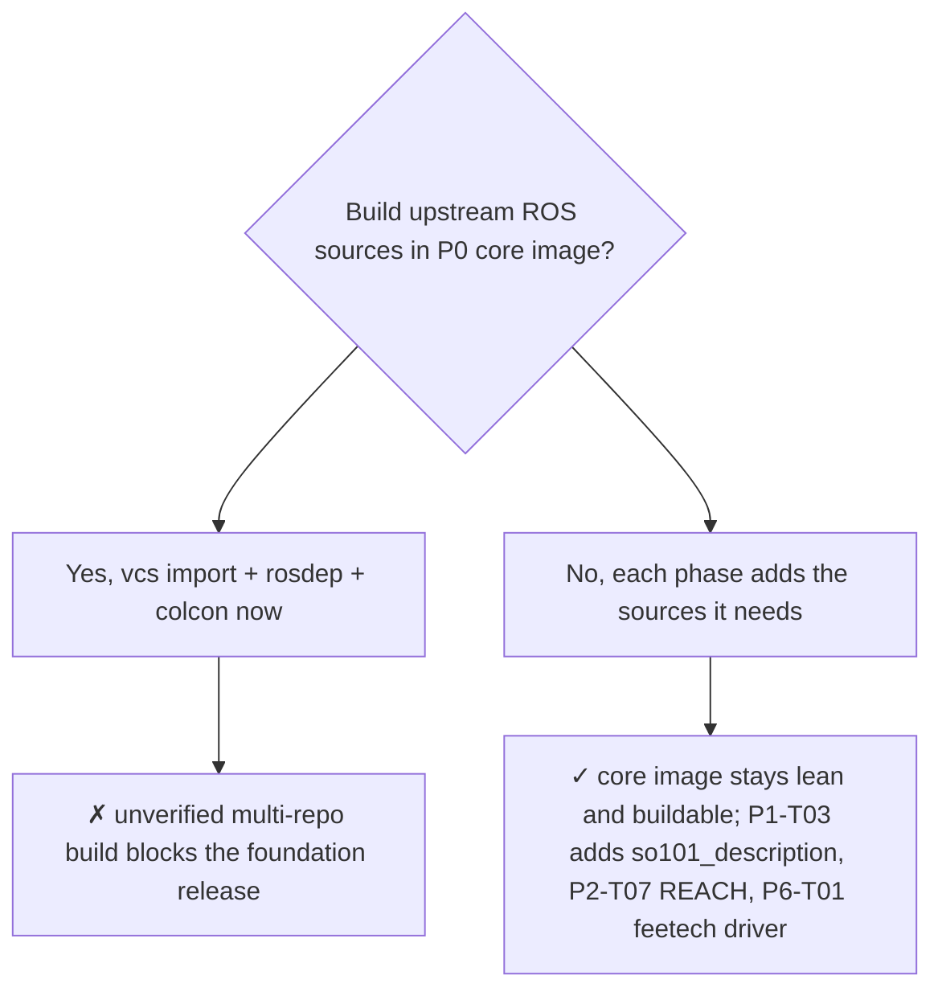
```mermaid
flowchart TD
  Q{Build upstream ROS sources in P0 core image?} --> A[Yes, vcs import + rosdep + colcon now]
  Q --> B[No, each phase adds the sources it needs]
  A --> A1[✗ unverified multi-repo build blocks the foundation release]
  B --> B1[✓ core image stays lean and buildable; P1-T03 adds so101_description, P2-T07 REACH, P6-T01 feetech driver]
```

#### D2: VLA client container contents
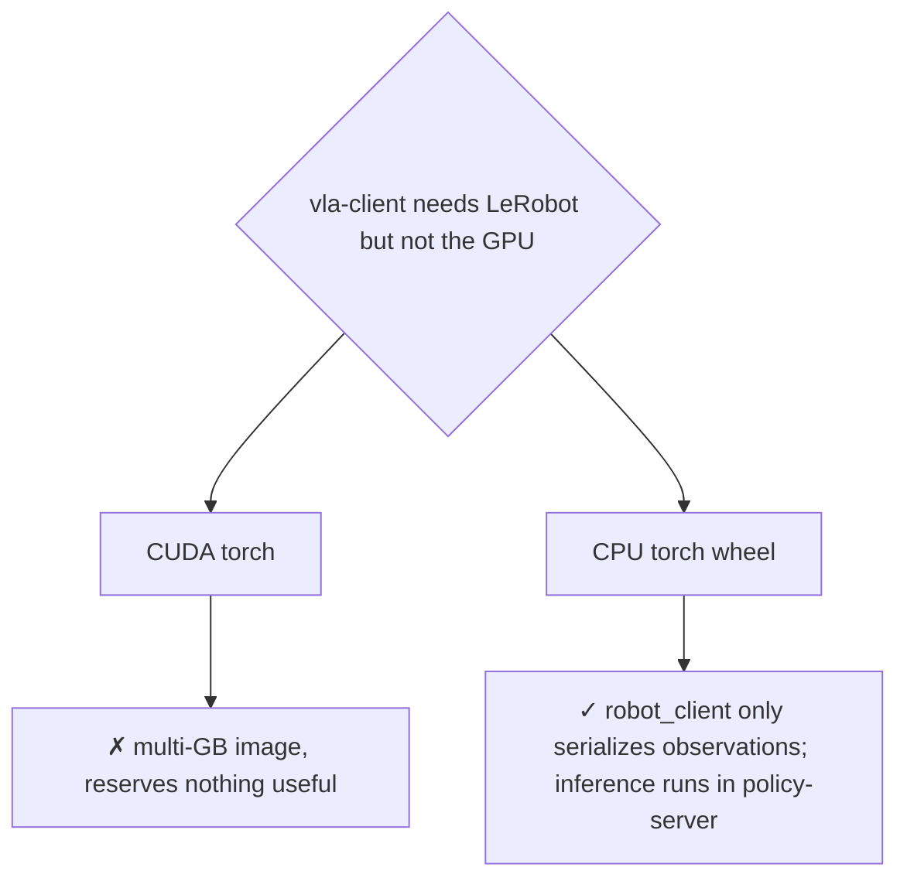
```mermaid
flowchart TD
  Q{vla-client needs LeRobot but not the GPU} --> A[CUDA torch]
  Q --> B[CPU torch wheel]
  A --> A1[✗ multi-GB image, reserves nothing useful]
  B --> B1[✓ robot_client only serializes observations; inference runs in policy-server]
```

### Open questions / follow-ups
- [ ] Build `core` and `vla` targets and record image digests (P1-T01, P5-T01).
- [ ] First CI run on a remote, which needs a GitHub remote (owner decision).
- [ ] Tag `v0.1.0` once the above pass.

---

## 2026-09-13 · P0-T04 · Workspace skeleton and interface package

**Context:** create every ROS 2 package up front so later phases only add content ([ARCHITECTURE §4](ARCHITECTURE.md#4-workspace-packages-our-code)).
**Outcome:** ✅ done. Commit: `feat(ws): scaffold ROS 2 Jazzy packages and cognibot_interfaces`.

### Work log
- Generated 6 `ament_python` and 3 `ament_cmake` packages (`cognibot_interfaces`, `cognibot_sim`, `cognibot_bringup`).
- Extracted all 13 interface definitions **verbatim from `docs/ROS_INTERFACES.md`** with a regex over the fenced blocks, so documentation and generated code match at creation time.
- Added `third_party.repos` (vcstool) with commit pins and gitignored `cognibot_ws/src/third_party/`.
- Verified in `ros:jazzy-ros-base` (digest `sha256:386d06ec…`): `colcon build` → 9 packages; `ros2 interface list` shows all 13 interfaces; Python packages import.

### Problems → root cause → solution
| # | Symptom | Root cause | Solution | Evidence |
|---|---|---|---|---|
| 1 | (anticipated) `install(DIRECTORY launch …)` fails on skeleton packages | CMake errors when an installed directory doesn't exist yet, and empty directories can't be committed to git | `foreach(dir …) if(EXISTS …) install(…)` in data packages | `cognibot_sim` / `cognibot_bringup` build in 1 s |
| 2 | LeRobot plugin packages would be picked up by colcon | colcon scans any directory with `pyproject.toml`/`setup.py` | `COLCON_IGNORE` in `cognibot_vla/lerobot_plugins/` | build lists 9 packages only |

### Decisions
#### D1: Where do the custom interface definitions live first, docs or code?
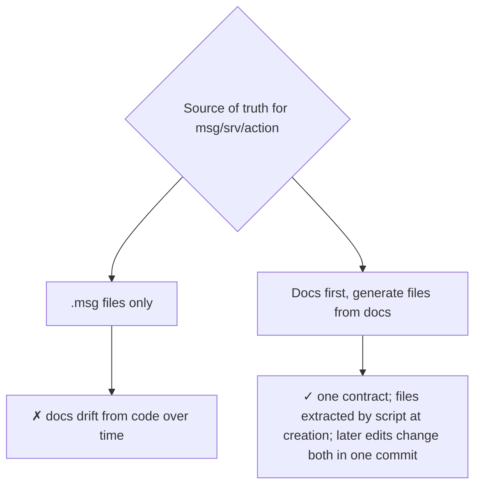
```mermaid
flowchart TD
  Q{Source of truth for msg/srv/action} --> A[.msg files only]
  Q --> B[Docs first, generate files from docs]
  A --> A1[✗ docs drift from code over time]
  B --> B1[✓ one contract; files extracted by script at creation; later edits change both in one commit]
```
- **Revisit if:** interfaces churn often. Then add a CI check that diffs docs blocks against the files.

---

## 2026-09-13 · P0-T01…T03 · Research, architecture and integration strategy

**Context:** turn the initial brief (Humble, Ollama/vLLM, custom SmolVLA node, custom teleop and mock driver) into a buildable, portfolio-grade plan for an RTX 3060 Laptop (6 GB VRAM), 40 GB RAM, i5-11400H, Ubuntu 24.04 host.
**Outcome:** ✅ done. Commits: `chore: initialize repository…`, `docs: add project scope, architecture…`.

### Work log
- Surveyed upstream docs and repositories: LeRobot `pyproject.toml`, SmolVLA config and async inference docs, ros-controls `mujoco_ros2_control` (README, index.ros.org releases), MuJoCo Menagerie, pick_ik, mink, foam, REACH, llama-swap, lerobot-ros, ROBOTIS zenoh plugin, RAI, ROSA.
- Surveyed the SO-101 ecosystem: so101-ros-physical-ai, adoodevv/so101_ros2, nimicurtis/so101_ros2, Pavankv92/lerobot_ws, MuRain37/so101-ros2-mujoco, so101-nexus, lerobot-env-so101, PhysAI starter.
- Queried the Hugging Face Hub for SmolVLA checkpoints and SO-101 **MuJoCo** datasets.
- Recorded pins for every component in [INTEGRATIONS.md](INTEGRATIONS.md).

### Problems → root cause → solution
| # | Symptom | Root cause | Solution | Evidence |
|---|---|---|---|---|
| 1 | The brief's stack (ROS 2 Humble + LeRobot SmolVLA) can't share one Python | LeRobot 0.6.2 declares `requires-python >= 3.12`; Humble on Jammy is Python 3.10, and rclpy is built against it | Move every ROS container to **Jazzy / Noble (3.12)** | [ADR-0001](adr/0001-jazzy-over-humble.md); LeRobot `pyproject.toml` |
| 2 | `mujoco_ros2_control` can't simulate the plain SO-101 URDF | The ros-controls plugin requires an MJCF (`mujoco_model` param); URDF→MJCF conversion is marked experimental | Use the Menagerie MJCF for physics and the upstream URDF only for `robot_description` and MoveIt, with a consistency test (planned P1-T03) | mujoco_ros2_control README |
| 3 | The LeRobot ROS plugin can't read ROS camera topics | `lerobot_robot_ros.ROS2Robot` builds cameras with LeRobot's `make_cameras_from_configs` (OpenCV/RealSense), with no ROS image camera type | Plan a small `lerobot_camera_ros2` plugin adapted from LeRobot PR #866 | `lerobot_robot_ros/robot.py` L20–L44 |
| 4 | (anticipated) ROS nodes in many containers stop discovering each other | With multicast disabled, CycloneDDS probes unicast ports per participant index, and the default `MaxAutoParticipantIndex` is 9 | Set it to 60 in `cyclonedds.xml`; document in NETWORKING §2.1 | Cyclone configuration docs |
| 5 | (anticipated) `cv_bridge` crashes in VLA/VLM containers | pip-installed numpy 2.x (LeRobot deps) shadows the apt numpy that `cv_bridge` was compiled against | Don't use `cv_bridge` there; convert `sensor_msgs/Image` ↔ numpy directly | ADR-0001 consequences |
| 6 | Qwen3-VL-4B (~3.6 GB) + SmolVLA (~2 GB) + display + EGL exceed 6 GB | The models are sized for separate GPUs | Keep SmolVLA resident; run the VLM through llama-swap profiles that offload layers into system RAM (`-ngl 99/16/0`); unload before VLA streaming | [VRAM_BUDGET §3](VRAM_BUDGET.md) |
| 7 | Zero-shot `smolvla_base` won't solve a new sim scene | The base model isn't trained on our embodiment and camera setup (the model card recommends fine-tuning); training is out of scope | Make VLA success criteria about pipeline correctness; prefer checkpoints fine-tuned in SO-101 MuJoCo scenes; add a LeRobot-native eval baseline | PROJECT_SCOPE §5; INTEGRATIONS §6 |

### Decisions

#### D1: ROS 2 distribution
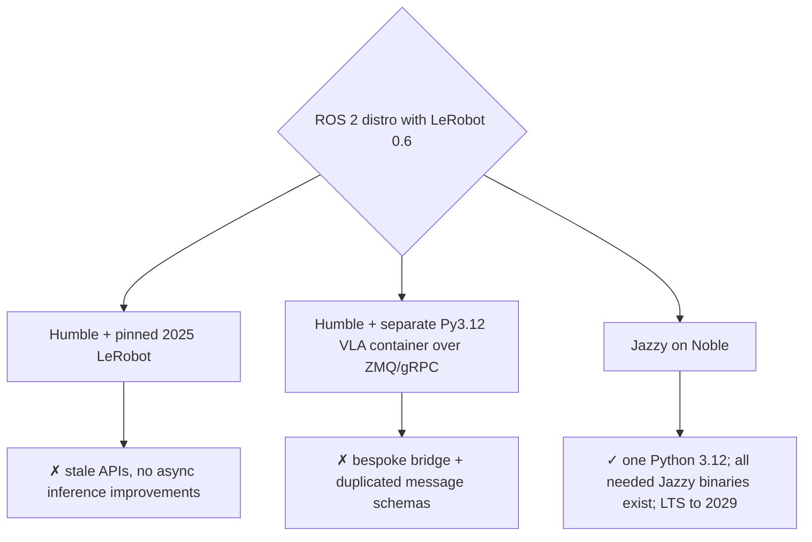
```mermaid
flowchart TD
  Q{ROS 2 distro with LeRobot 0.6} --> H1[Humble + pinned 2025 LeRobot]
  Q --> H2[Humble + separate Py3.12 VLA container over ZMQ/gRPC]
  Q --> J[Jazzy on Noble]
  H1 --> H1x[✗ stale APIs, no async inference improvements]
  H2 --> H2x[✗ bespoke bridge + duplicated message schemas]
  J --> Jv[✓ one Python 3.12; all needed Jazzy binaries exist; LTS to 2029]
```
Promoted to [ADR-0001](adr/0001-jazzy-over-humble.md).

#### D2: Build components or integrate existing ones
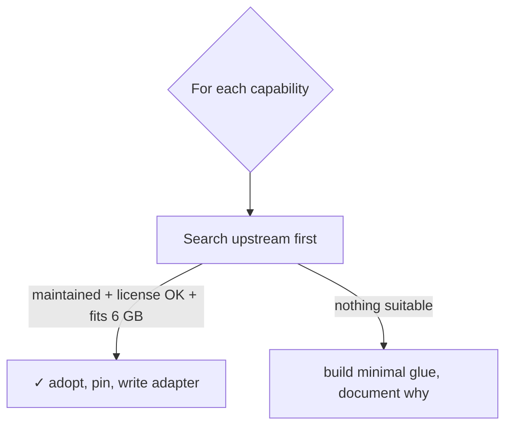
```mermaid
flowchart TD
  Q{For each capability} --> S[Search upstream first]
  S -->|maintained + license OK + fits 6 GB| U[✓ adopt, pin, write adapter]
  S -->|nothing suitable| B[build minimal glue, document why]
```
Outcome: SmolVLA node → LeRobot `policy_server` + `robot_client`; mock servo driver → `feetech_ros2_driver` mock hardware; sphere tool → foam; reachability → REACH; SO-101 description/MoveIt → so101-ros-physical-ai. Promoted to [ADR-0006](adr/0006-integrate-dont-invent.md).

#### D3: VLM server
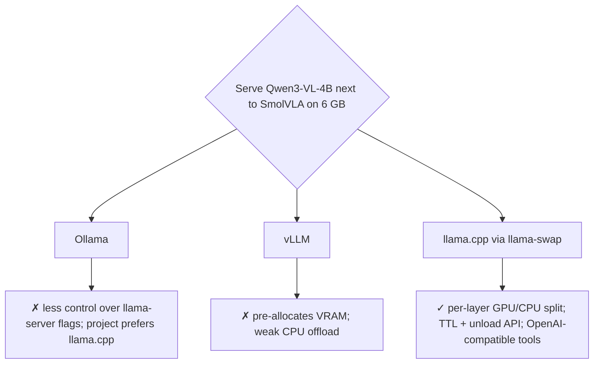
```mermaid
flowchart TD
  Q{Serve Qwen3-VL-4B next to SmolVLA on 6 GB} --> O[Ollama]
  Q --> V[vLLM]
  Q --> L[llama.cpp via llama-swap]
  O --> Ox[✗ less control over llama-server flags; project prefers llama.cpp]
  V --> Vx[✗ pre-allocates VRAM; weak CPU offload]
  L --> Lv[✓ per-layer GPU/CPU split; TTL + unload API; OpenAI-compatible tools]
```
Promoted to [ADR-0005](adr/0005-llamacpp-llamaswap-qwen3vl.md).

#### D4: VRAM sharing strategy
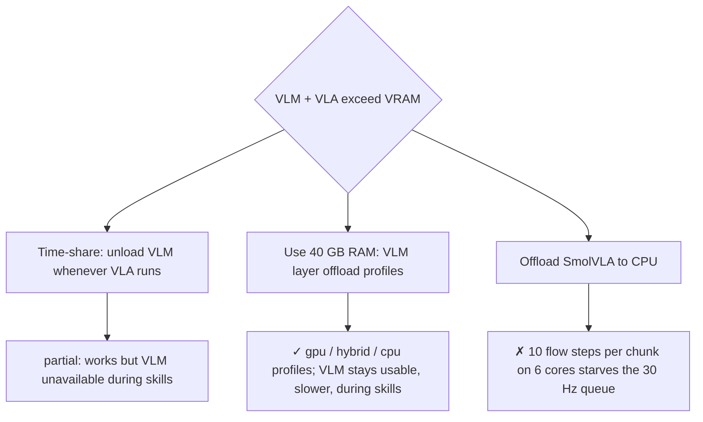
```mermaid
flowchart TD
  Q{VLM + VLA exceed VRAM} --> T[Time-share: unload VLM whenever VLA runs]
  Q --> R[Use 40 GB RAM: VLM layer offload profiles]
  Q --> C[Offload SmolVLA to CPU]
  C --> Cx[✗ 10 flow steps per chunk on 6 cores starves the 30 Hz queue]
  T --> Tx[partial: works but VLM unavailable during skills]
  R --> Rv[✓ gpu / hybrid / cpu profiles; VLM stays usable, slower, during skills]
```
- **Revisit if:** measured hybrid-profile VRAM (P5-T07) leaves < 300 MiB headroom.

#### D5: Source of the SO-101 simulation scene
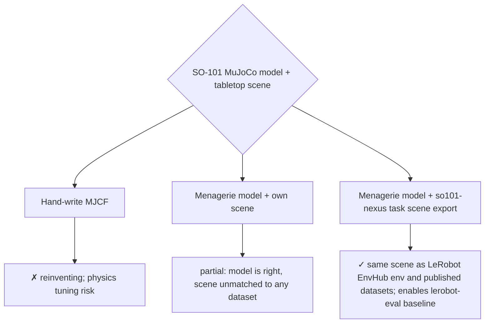
```mermaid
flowchart TD
  Q{SO-101 MuJoCo model + tabletop scene} --> W[Hand-write MJCF]
  Q --> M[Menagerie model + own scene]
  Q --> N[Menagerie model + so101-nexus task scene export]
  W --> Wx[✗ reinventing; physics tuning risk]
  M --> Mx[partial: model is right, scene unmatched to any dataset]
  N --> Nv[✓ same scene as LeRobot EnvHub env and published datasets; enables lerobot-eval baseline]
```
Model lineage: TheRobotStudio SO-ARM100 (official) → Menagerie `robotstudio_so101` (tuned collisions and actuators) → so101-nexus scenes.

#### D6: Real-time teleop IK on a 5-DOF arm
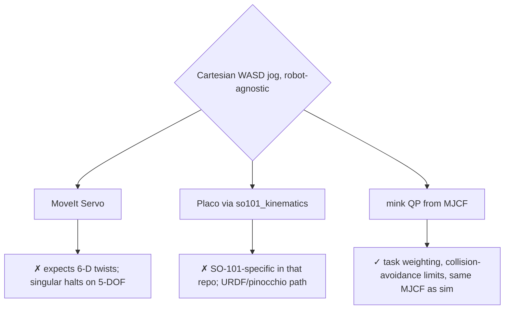
```mermaid
flowchart TD
  Q{Cartesian WASD jog, robot-agnostic} --> S[MoveIt Servo]
  Q --> P[Placo via so101_kinematics]
  Q --> K[mink QP from MJCF]
  S --> Sx[✗ expects 6-D twists; singular halts on 5-DOF]
  P --> Px[✗ SO-101-specific in that repo; URDF/pinocchio path]
  K --> Kv[✓ task weighting, collision-avoidance limits, same MJCF as sim]
```
Promoted to [ADR-0003](adr/0003-mink-plus-moveit.md).

#### D7: VLM agent runtime (pending spike)
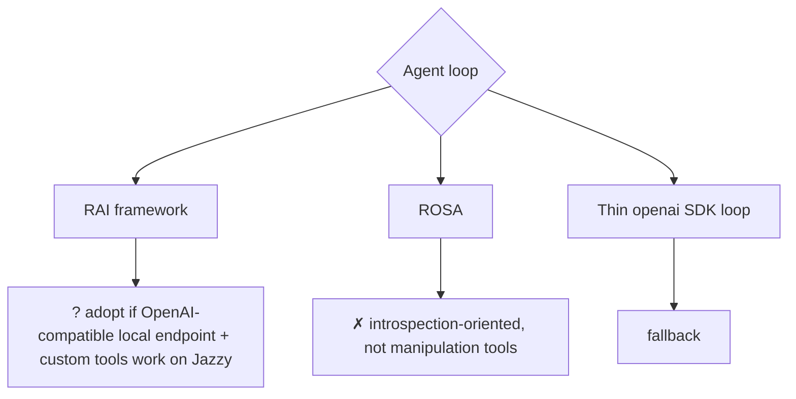
```mermaid
flowchart TD
  Q{Agent loop} --> R[RAI framework]
  Q --> RO[ROSA]
  Q --> T[Thin openai SDK loop]
  RO --> ROx[✗ introspection-oriented, not manipulation tools]
  R --> Rq[? adopt if OpenAI-compatible local endpoint + custom tools work on Jazzy]
  T --> Tq[fallback]
```
Decided by P4-T01 → ADR-0007.

### Open questions / follow-ups
- [ ] Exact `mujoco_ros2_control` camera plugin parameters and topic layout (P1-T01).
- [ ] Whether `lerobot_robot_ros` lets the command topic be configured so commands reach the safety filter (P5-T04).
- [ ] Whether rosbridge in Jazzy proxies ROS 2 actions for roslibjs (P3-T02).
- [ ] Which SmolVLA checkpoint best matches the exported scene's cameras (P5-T02/T05).
