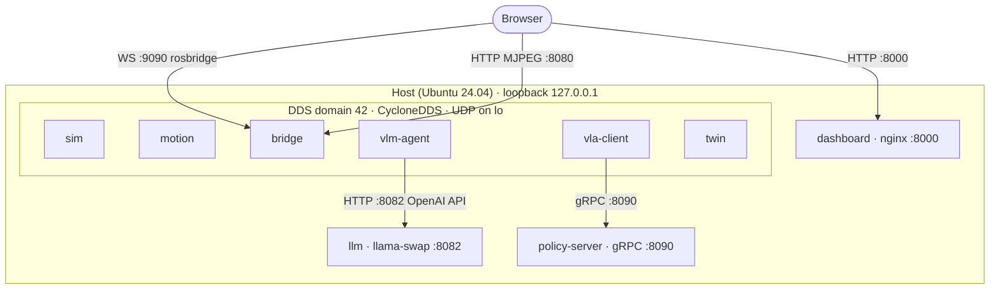
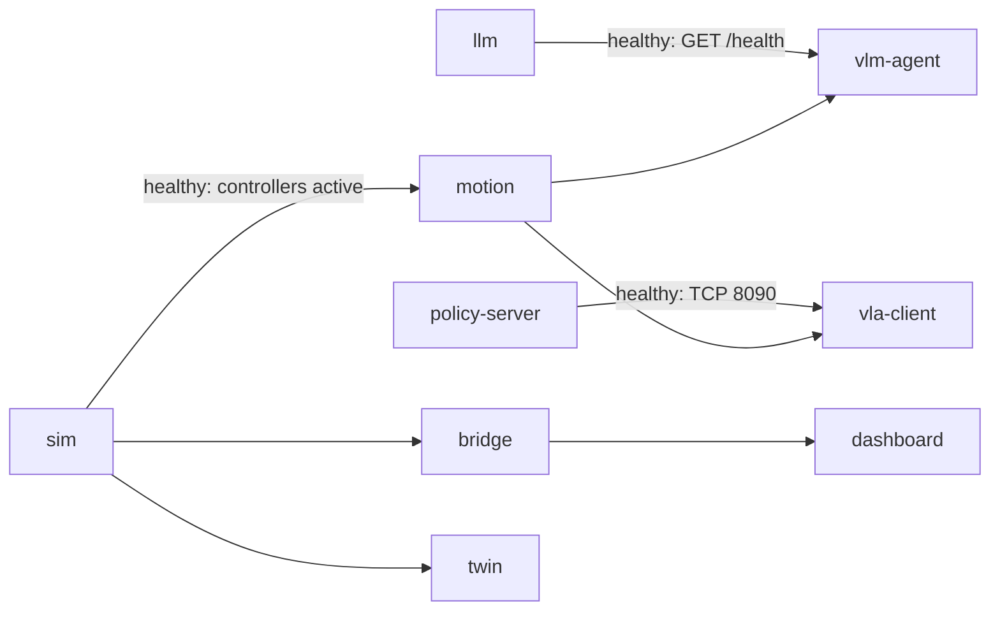

# Networking: CogniBot-ROS2-VLA

Related: [ARCHITECTURE.md](ARCHITECTURE.md) · [ROS_INTERFACES.md](ROS_INTERFACES.md) · [ADR-0004](adr/0004-cyclonedds-host-network.md)

This document covers how containers find each other, what travels over which transport, and how to debug it.

---

## 1. Topology

Everything runs on **one host**. ROS 2 services use the host network stack, so DDS sees every participant on `lo`. Non-ROS services (llama-swap, policy_server, nginx) are plain TCP servers bound to `127.0.0.1`.



## 2. ROS 2 middleware configuration

| Setting | Value | Why |
|---|---|---|
| Distro | Jazzy | [ADR-0001](adr/0001-jazzy-over-humble.md) |
| `RMW_IMPLEMENTATION` | `rmw_cyclonedds_cpp` | Predictable in Docker and well understood for large messages. Must be identical in every container. |
| `ROS_DOMAIN_ID` | `42` (from `.env`) | Keeps the stack away from other ROS graphs on the machine (default 0) |
| `ROS_AUTOMATIC_DISCOVERY_RANGE` | `LOCALHOST` | Jazzy discovery control: nothing leaks onto the LAN |
| `CYCLONEDDS_URI` | `file:///etc/cognibot/cyclonedds.xml` | Loopback interface, unicast peers, larger socket buffers, more participant slots |
| `network_mode` | `host` | Avoids DDS through Docker NAT (multicast and ephemeral ports break) |
| `ipc` | `host` | Lets a future switch to shared-memory transports (Fast DDS SHM, iceoryx) work without changes |

### 2.1 `cyclonedds.xml` essentials

```xml
<CycloneDDS>
  <Domain Id="any">
    <General>
      <Interfaces><NetworkInterface name="lo"/></Interfaces>
      <AllowMulticast>false</AllowMulticast>
      <MaxMessageSize>65500B</MaxMessageSize>
    </General>
    <Discovery>
      <ParticipantIndex>auto</ParticipantIndex>
      <MaxAutoParticipantIndex>60</MaxAutoParticipantIndex>
      <Peers><Peer address="localhost"/></Peers>
    </Discovery>
    <Internal>
      <SocketReceiveBufferSize min="10MB"/>
      <SocketSendBufferSize min="10MB"/>
    </Internal>
  </Domain>
</CycloneDDS>
```

- **`MaxAutoParticipantIndex`:** with multicast off, Cyclone discovers peers by probing a fixed range of unicast ports, one per participant index. The default limit (9) is too low once sim, controllers, MoveIt, rosbridge and agents all run, and processes past the limit silently never discover each other.
- **Socket buffers:** a 640×480 RGB frame is about 0.9 MB and gets fragmented. Small kernel buffers drop fragments, and images arrive late or not at all.

### 2.2 Host sysctl (documented in [SETUP.md](SETUP.md))

```bash
sudo sysctl -w net.core.rmem_max=2147483647
sudo sysctl -w net.core.wmem_max=2147483647
sudo sysctl -w net.ipv4.ipfrag_high_thresh=134217728   # 128 MB for image fragments
```

Without these, Cyclone logs `failed to increase socket receive buffer size` and camera topics lose frames under load.

## 3. Port map

With host networking, every server must bind to `127.0.0.1` through its own configuration.

| Port | Proto | Service | Bound by | Consumer |
|---|---|---|---|---|
| 8000 | HTTP | Dashboard SPA (nginx) | `dashboard` | Browser |
| 5173 | HTTP | Dashboard dev server (Vite, dev only) | host `npm run dev` | Browser |
| 9090 | WebSocket | `rosbridge_websocket` (`address:=127.0.0.1`) | `bridge` | Dashboard (roslibjs) |
| 8080 | HTTP (MJPEG) | `web_video_server` (`address:=127.0.0.1`) | `bridge` | Dashboard `` |
| 8082 | HTTP | llama-swap OpenAI-compatible API (`-listen 127.0.0.1:8082`) | `llm` | `vlm-agent`, `vla-client` (unload call) |
| 5800–5899 | HTTP | llama-server upstream instances spawned by llama-swap (internal) | `llm` | llama-swap only |
| 8090 | gRPC | LeRobot `policy_server` (`--host=127.0.0.1 --port=8090`) | `policy-server` | `vla-client` |
| 17900+ | UDP | CycloneDDS discovery and user traffic for domain 42 (`7400 + 250·42 + offsets`) | all ROS services | all ROS services |

Nothing is published to the LAN. See §8 for remote access.

## 4. Topic traffic and QoS

| Topic | Type | Rate | Approx. bandwidth | QoS |
|---|---|---|---|---|
| `/joint_states` | `sensor_msgs/JointState` | 100 Hz | < 0.1 MB/s | sensor data (best effort, depth 5) |
| `/camera/front/color/image_raw` | `sensor_msgs/Image` rgb8 640×480 | 15–30 Hz | 14–28 MB/s | sensor data |
| `/camera/front/depth/image_raw` | `sensor_msgs/Image` 32FC1 640×480 | 15 Hz | ~18 MB/s | sensor data |
| `/camera/front/color/camera_info` | `sensor_msgs/CameraInfo` | matches image | negligible | sensor data |
| `/camera/wrist/color/image_raw` | `sensor_msgs/Image` rgb8 480×360 | 15–30 Hz | 8–16 MB/s | sensor data |
| `/tf`, `/tf_static` | `tf2_msgs/TFMessage` | 100 Hz / latched | < 0.1 MB/s | default / transient local |
| `/cognibot/joint_command` | `sensor_msgs/JointState` | 30–100 Hz | negligible | reliable, depth 1 |
| `/arm_position_controller/commands` | `std_msgs/Float64MultiArray` | 30–100 Hz | negligible | reliable, depth 1 |
| `/cognibot/teleop/cmd` | `cognibot_interfaces/TeleopCommand` | 30 Hz | negligible | reliable, depth 1 |
| `/cognibot/mode` | `cognibot_interfaces/ControlMode` | on change | negligible | reliable, **transient local** |
| `/cognibot/agent/events` | `cognibot_interfaces/AgentEvent` | bursty | negligible | reliable, depth 50 |
| `/cognibot/gpu` | `cognibot_interfaces/GpuStatus` | 1 Hz | negligible | reliable, depth 1 |
| `/cognibot/viz/*` | `visualization_msgs/MarkerArray` | 1 Hz / on change | small | reliable, transient local |

Worst-case loopback load with all cameras at 30 Hz is about 60 MB/s, which is fine on `lo`. The dashboard never subscribes to raw images through rosbridge (JSON-encoded images would saturate the WebSocket); it uses MJPEG from `web_video_server` instead.

## 5. Service-to-service flows that bypass DDS

| Flow | Transport | Payload | Notes |
|---|---|---|---|
| `vlm-agent` → `llm` | HTTP/1.1 JSON (OpenAI `chat/completions`) | Messages + base64 JPEG frame (~60 KB) + tool schemas | One request per agent step; `keep_alive` managed by llama-swap `ttl` |
| `vla-client` → `llm` | HTTP `POST /api/models/unload` | empty | Frees VRAM before the VLA starts streaming |
| `vla-client` ↔ `policy-server` | gRPC (LeRobot `async_inference` protos) | Pickled observation dicts (images + state) / action chunks | Client and server **must** run the same `lerobot` version |
| Browser → `bridge` | WebSocket JSON (rosbridge v2 protocol) | Topics, services, actions | Throttle subscriptions (`throttle_rate`) for joint states in the UI |
| Browser → `bridge` | HTTP MJPEG | `/stream?topic=/camera/front/color/image_raw&quality=70` | |

## 6. Startup ordering and health



| Service | Healthcheck |
|---|---|
| `sim` | `ros2 control list_controllers \| grep -q "joint_state_broadcaster.*active"` |
| `bridge` | `bash -c '</dev/tcp/127.0.0.1/9090'` |
| `llm` | `curl -fsS http://127.0.0.1:8082/health` |
| `policy-server` | `python -c "import socket; socket.create_connection(('127.0.0.1', 8090), 2)"` |

## 7. Security posture

- Everything binds to loopback. rosbridge has **no authentication**, so exposing 9090 on a LAN hands arm control to anyone on that network.
- The containers run as a non-root user with the host UID/GID. Only `twin` gets device access (`/dev/ttyACM*`), and only once enabled.
- No secrets are needed for public models. If a gated HF checkpoint is used, `HF_TOKEN` comes from `.env` (gitignored) and is passed only to `policy-server`.

## 8. Multi-machine and remote access (optional, unsupported)

| Need | Approach |
|---|---|
| View the dashboard from another laptop | SSH tunnel: `ssh -L 8000:localhost:8000 -L 9090:localhost:9090 -L 8080:localhost:8080 user@host` |
| Run policy-server on a bigger GPU box | Point `vla-client` `server_address` at that box's gRPC port (WireGuard/Tailscale recommended); DDS stays local |
| Split ROS nodes across machines | Set `ROS_AUTOMATIC_DISCOVERY_RANGE=SUBNET`, drop the loopback-only interface in `cyclonedds.xml`, or use `rmw_zenoh_cpp` with a router. Not tested in this project |

## 9. Troubleshooting

| Symptom | Check | Fix |
|---|---|---|
| `ros2 topic list` in one container doesn't show topics from another | `printenv \| grep -E 'ROS_\|RMW\|CYCLONE'` in both | Make `ROS_DOMAIN_ID`, `RMW_IMPLEMENTATION` and `CYCLONEDDS_URI` identical |
| Nodes appear, then vanish, as the stack grows | Count participants: `ros2 node list \| wc -l` | Raise `MaxAutoParticipantIndex` |
| Images arrive at 1–2 Hz or not at all | `ros2 topic hz /camera/front/color/image_raw`; Cyclone warnings in logs | Apply the §2.2 sysctls; reduce resolution or rate |
| Works as root, fails as user | Stale `/dev/shm` segments from another UID | `docker compose down`, then remove stale `/dev/shm/*` segments |
| rosbridge connects but actions fail | rosbridge version and action support | Use the service/topic fallbacks noted in ROS_INTERFACES.md |
| `vla-client` handshake errors | `pip show lerobot` in both containers | Pin the same LeRobot version |
| Discovery is slow at startup | Many participants probing peers | Expected (a few seconds); use healthchecks, not sleeps |

Useful commands: `ros2 doctor --report`, `ros2 daemon stop` (after changing env), `ros2 topic info -v <topic>` (shows QoS mismatches), `ros2 topic bw <topic>`.
