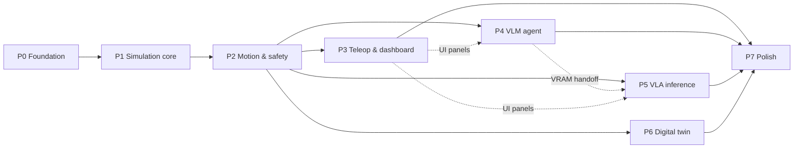

# Project Plan: CogniBot-ROS2-VLA

Related: [PROJECT_SCOPE.md](PROJECT_SCOPE.md) · [ARCHITECTURE.md](ARCHITECTURE.md) · [DEVLOG.md](DEVLOG.md)

The high-level roadmap. Each phase is split into small tasks with runnable acceptance criteria on a private task board. Progress, problems and decisions for each task are recorded in [DEVLOG.md](DEVLOG.md), and user-visible changes in [CHANGELOG.md](../CHANGELOG.md).

---

## 1. Milestones

| Phase | Name | Tag | Outcome | Depends on |
|---|---|---|---|---|
| **P0** | Foundation | `v0.1.0` | Repo, docs, ADRs, Docker/Compose profiles, package skeletons, interfaces, CI, commit hooks | – |
| **P1** | Simulation core | `v0.2.0` | Headless MuJoCo SO-101 tabletop scene in ROS 2 with controllers, RGB-D cameras and TF; Panda variant; robot registry | P0 |
| **P2** | Motion & safety | `v0.3.0` | MoveIt 2 + pick_ik planning, mink teleop IK, foam collision spheres, safety filter, REACH study + workspace sphere, mode manager, fetch/place actions | P1 |
| **P3** | Teleop & dashboard | `v0.4.0` | Web dashboard (impeccable design): camera, joints, WASD / ↑↓ / G teleop, mode switch, safety overlays, VRAM gauge | P2 |
| **P4** | VLM agent | `v0.5.0` | llama-swap + Qwen3-VL-4B; agent node with tool calling; bbox → 3D grounding; grounding eval; dashboard chat and tool trace | P2 (P3 for UI) |
| **P5** | VLA inference | `v0.6.0` | LeRobot policy_server + robot_client with ROS plugins; `ExecuteSkill` action; VRAM profiles; measured budget | P2 (P4 for handoff) |
| **P6** | Digital twin | `v0.7.0` | `feetech_ros2_driver` / mock hardware under `/real`, mirrored into sim through the safety filter | P2 |
| **P7** | Polish & showcase | `v1.0.0` | README with GIFs, architecture figure, benchmarks, demo scripts, docs audit | P3–P6 |

**Priority:** P1 and P2 first (Jazzy + MuJoCo, IK solvers, collision spheres, collision avoidance). P3–P6 can then run in parallel.

## 2. Dependency graph

## 3. Phase details

### P0: Foundation (`v0.1.0`)
- **Goal:** anyone can clone, build the images and start an empty-but-healthy stack.
- **Exit criteria:** `docker compose config` valid for all profiles; images build; interfaces visible via `ros2 interface list`; CI green; commit hook active.

### P1: Simulation core (`v0.2.0`)
- **Goal:** `make sim` gives a headless MuJoCo SO-101 on a desk with a red cube and blue cup, controllable through ros2_control, with cameras and TF.
- **Key risks:** EGL in Docker on hybrid graphics; camera plugin config; joint-name alignment between Menagerie MJCF and so101_description URDF.
- **Exit criteria:** controllers active; `/joint_states` ≥ 100 Hz; RGB-D ≥ 15 Hz; a scripted JTC goal moves the arm; camera reprojection test passes; `robot:=panda` also comes up.

### P2: Motion & safety (`v0.3.0`)
- **Goal:** the arm moves safely under three kinds of command: planned (MoveIt), jogged (mink) and streamed (through the safety filter).
- **Key risks:** 5-DOF IK behavior; sphere fit quality; REACH on Jazzy.
- **Exit criteria:** fetch/place ≥ 90% on ground-truth poses; jog stress test collision-free; safety tests 100%; reach agreement ≥ 95%.

### P3: Teleop & dashboard (`v0.4.0`)
- **Goal:** a polished operator console that works in a browser at `localhost:8000`.
- **Process:** use the **impeccable** skill for direction, design system and critique; record `dashboard/DESIGN.md`.
- **Exit criteria:** all panels live against the sim; keyboard teleop with dead-man; mode switching; Lighthouse accessibility ≥ 90; renders at 1280 px and 1920 px.

### P4: VLM agent (`v0.5.0`)
- **Goal:** natural-language pick-and-place through tool calls, visible step by step.
- **Key risks:** tool-call reliability from a 4B model; bbox coordinate convention; depth alignment.
- **Exit criteria:** median grounding error ≤ 3 cm; scripted end-to-end task succeeds in ≥ 7/10 runs; the agent event trace shows in the dashboard.

### P5: VLA inference (`v0.6.0`)
- **Goal:** a SmolVLA checkpoint drives the sim arm through the standard LeRobot async stack.
- **Key risks:** LeRobot version drift; ROS camera plugin; VRAM.
- **Exit criteria:** 30 Hz ± 10% action stream for 60 s; latency and queue metrics published; VRAM measured and documented; no OOM in the 10-minute scenario.

### P6: Digital twin (`v0.7.0`)
- **Goal:** a real (or mock) SO-101 mirrored into MuJoCo.
- **Exit criteria:** mock-hardware mirroring < 50 ms lag; documented procedure for the real arm (hardware-gated validation).

### P7: Polish (`v1.0.0`)
- **Goal:** a portfolio-ready repository.
- **Exit criteria:** README with a demo GIF per capability; benchmark table filled in; all docs match the code; clean-clone build verified.

## 4. Working agreements

- **Branching:** `main` is always buildable. Work goes on `feat/<task-id>-<slug>` branches, merged with `--no-ff` or rebased. Tag each phase on `main`.
- **Commits:** Conventional Commits (`feat`, `fix`, `docs`, `build`, `ci`, `test`, `refactor`, `chore`, `perf`), with a scope that names the package (`feat(motion): …`). The body explains *why*. One task → one or a few focused commits.
- **Authorship:** the repository owner is the sole author. No `Co-authored-by` or AI attribution trailers (enforced by `.githooks/commit-msg`).
- **Changelog:** every user-visible change adds a line under `## [Unreleased]` in `CHANGELOG.md` (Keep a Changelog). When a phase is tagged, `Unreleased` is renamed to the version.
- **Pins:** new third-party components are added to [INTEGRATIONS.md](INTEGRATIONS.md) in the same commit.
- **Definition of done:** acceptance commands pass; tests added; docs updated; CHANGELOG entry added; DEVLOG entry written (work, problems, decisions).

## 5. Versioning

Semantic Versioning. `0.x` while phases land. `1.0.0` when P7 completes. Docker images are tagged `cognibot/<image>:<version>` and `:latest` locally.
