# VRAM Budget: RTX 3060 Laptop (6 GB)

Related: [ARCHITECTURE.md §7.3](ARCHITECTURE.md#73-vla-skill-p5) · [ADR-0005](adr/0005-llamacpp-llamaswap-qwen3vl.md)

> **Status:** these are estimates. P5-T06 replaces them with measured numbers (`nvidia-smi --query-compute-apps` log plus `/cognibot/gpu`) and records the method.

## 1. Device

| Property | Value |
|---|---|
| GPU | NVIDIA GeForce RTX 3060 Laptop GPU (Ampere, sm_86, bf16 supported) |
| VRAM | 6144 MiB |
| Driver | 595.x (supports CUDA 12.x and 13.x user-space runtimes) |
| System RAM | 40 GB (≈38 GiB usable) — used as the VLM offload tier |
| CPU | Intel i5-11400H, 6C/12T |

## 2. Consumers (estimates)

| Consumer | Container | Precision | Estimate (MiB) | Notes |
|---|---|---|---|---|
| Host display / compositor | host | – | 300–500 | ~0 if the display runs on the iGPU (hybrid graphics, PRIME on-demand) |
| MuJoCo EGL context + 2 cameras (640×480, 480×360) | `sim` | – | 150–300 | Offscreen framebuffers + textures from Menagerie assets |
| llama.cpp: Qwen3-VL-4B-Instruct Q4_K_M weights | `llm` | Q4_K_M | ~2500 | GGUF ≈ 2.5 GB |
| llama.cpp: mmproj (vision encoder) | `llm` | Q8_0 | ~450 | F16 variant ≈ 800 MiB; we use Q8_0 |
| llama.cpp: KV cache, 4096 ctx, `q8_0` cache type | `llm` | q8_0 | ~300 | Grows with `-c`; images cost tokens (downscale to ≤ 640 px) |
| llama.cpp: CUDA context + compute buffers | `llm` | – | ~350 | |
| SmolVLA (450M) weights | `policy-server` | bf16 | ~900 | |
| SmolVLA activations (1 obs, 2 cameras 512², chunk 50, 10 flow steps) | `policy-server` | bf16 | ~500–800 | |
| PyTorch CUDA context + allocator cache | `policy-server` | – | ~400 | |

**Totals:**

| Scenario | Estimate (MiB) | Fits in 6144? |
|---|---|---|
| Core only (sim + display) | 450–800 | ✅ |
| Core + VLM loaded | ~4050–4400 | ✅ |
| Core + VLA loaded | ~2250–2900 | ✅ |
| Core + VLM (gpu profile) **and** VLA at once | ~5850–7300 | ❌ not reliably |
| Core + VLM (hybrid profile) + VLA | ~3950–4600 | ✅ with margin |
| Core + VLM (cpu profile) + VLA | ~2400–3100 | ✅ |

## 3. Strategy: use 40 GB of system RAM as a VRAM overflow tier

The host has **~38 GiB usable RAM** and a 6-core / 12-thread i5-11400H. llama.cpp can split a GGUF model between GPU and CPU at the layer level (`-ngl N`), and can keep the vision projector on the CPU (`--no-mmproj-offload`). So the VLM **doesn't have to leave** when the VLA needs the GPU; it can shrink its GPU share instead.

llama-swap exposes the *same* model under three **profiles** (separate entries in `config.yaml`, same GGUF files, different flags). The agent picks one by model name:

| Profile (model name) | llama-server flags (key ones) | Est. VRAM (MiB) | Est. system RAM | Speed | When |
|---|---|---|---|---|---|
| `qwen3-vl-4b-gpu` | `-ngl 99` (all 36 layers), mmproj on GPU | ~3600 | ~0.5 GB | fastest (tens of tok/s) | VLA idle (planning, grounding, chat) |
| `qwen3-vl-4b-hybrid` | `-ngl 16`, mmproj on GPU | ~1700 | ~1.5 GB | medium | VLA resident and **idle** between skills |
| `qwen3-vl-4b-cpu` | `-ngl 0 --no-mmproj-offload`, `-t 6` | ~0 (small CUDA ctx) | ~3.5 GB | slow (single-digit tok/s, image encode several s) | VLA **actively streaming** (e.g. the agent monitors a running skill) |

Rules implemented by `vlm_agent_node` and `skill_executor_node`:

1. **SmolVLA stays resident on the GPU** in `policy-server` (bf16). It needs a stable 30 Hz, so it's never offloaded to the CPU.
2. **Default is `qwen3-vl-4b-gpu`.** Before `ExecuteSkill` starts streaming, `skill_executor_node` calls `POST /api/models/unload` on llama-swap. Any agent call during the skill uses `qwen3-vl-4b-cpu` (or `-hybrid` if measurements show headroom), which fits the table above.
3. **llama-swap `ttl`** evicts idle models, and `groups` with `swap: true` guarantee that only one Qwen profile is loaded at a time.
4. **Caps and knobs:**
   - llama-server: `-c 4096 --cache-type-k q8_0 --cache-type-v q8_0 --flash-attn on -np 1`, with images downscaled to ≤ 640 px before sending.
   - policy-server: bf16, `PYTORCH_CUDA_ALLOC_CONF=expandable_segments:True`.
   - sim: render only the cameras that consumers need, at the minimum useful resolution.
5. **RAM guardrails (compose `mem_limit`):**

   | Service | Limit |
   |---|---|
   | `llm` | 12 g |
   | `policy-server` | 8 g |
   | `sim` + `motion` | 6 g |

   This leaves ≥ 10 GB for the host, browser and page cache. mmap'd GGUF pages count as page cache, which keeps reloads fast.

```mermaid
gantt
  dateFormat  s
  axisFormat  %S
  title VRAM ownership during "pick the green cube, then run a VLA skill" (illustrative)
  section llm (Qwen3-VL)
  gpu profile: plan + ground   :a1, 0, 8s
  unload                       :milestone, 8, 0s
  cpu profile: monitor (optional) :a2, 8, 20s
  section policy-server (SmolVLA)
  resident (idle)              :b0, 0, 8s
  streaming actions (GPU)      :b1, 8, 20s
```



### 3.1 Why not offload SmolVLA instead?

SmolVLA runs 10 flow-matching steps per chunk. On a 6-core laptop CPU, a chunk would take seconds, which starves the 30 Hz queue even with async chunking. The VLM runs as bursty, latency-tolerant requests, so it takes the CPU/RAM tier.

## 4. Measurement procedure (P5-T06)

```bash
# host, while running the scripted scenario
nvidia-smi --query-gpu=timestamp,memory.used,utilization.gpu --format=csv -lms 500 > vram_log.csv
nvidia-smi --query-compute-apps=pid,process_name,used_memory --format=csv -l 1 > vram_apps.csv
```

Record the peak and steady-state values per scenario in the table below and commit the raw CSV under `benchmarks/vram/`.

| Scenario | Peak (MiB) | Steady (MiB) | Date | Commit |
|---|---|---|---|---|
| Core only | – | – | – | – |
| Core + VLM | – | – | – | – |
| Core + VLA | – | – | – | – |
| Core + VLM hybrid + VLA | – | – | – | – |
| Core + VLM cpu + VLA (tok/s noted) | – | – | – | – |
| Full scripted task | – | – | – | – |
